## 过表达/干扰 WNT5B 对 鹿茸MSCs 的影响
---
### 一、试验前鉴定
两个试验分别需要鉴定 **慢病毒最佳MOI** 和 **最佳的干扰siRNA**，其余的方法步骤一致。

!!! info 过表达WNT5B：鉴定最佳MOI
    $P_3$ MSCs转染过表达WNT5B慢病毒`48h`后，**在倒置荧光显微镜下观察荧光反应，选择荧光效率最佳的MOI浓度**。（细胞成活率必须高于80%）

    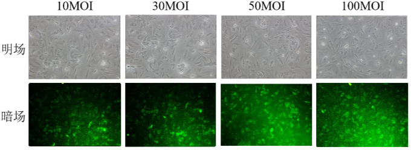

!!! error 干扰WNT5B：鉴定最佳siRNA
    分别用不同的siRNA构建转染复合物转染$P_2$ MSCs，培养`48-72h`后收样，**通过RT-qPCR和WB鉴定WNT5B的表达量和蛋白质产量**。

    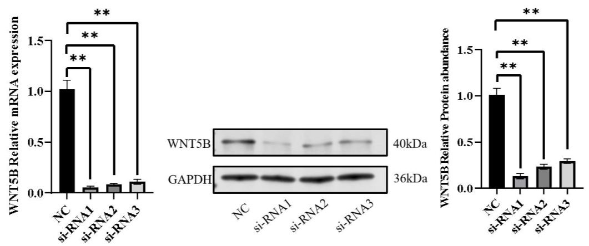

### 二、RNA提取
选取生长状态良好的 $P_3$  MSCs，按照 2ml/孔（$1.5×10^5$ 个细胞）铺于 6 孔板上，细胞融合度达 80%后进行转染，`48h` 后收集细胞提取总 RNA 反转录为 cDNA

### 三、RT-qPCR & WB
- **RT-qPCR**：设计鹿 ROR2、鹿CDC42、鹿 JNK、鹿 RAC1的扩增引物。其均为 WNT/PCP 信号通路关键基因
*引物设计如常，略。*
- **WB**(由于过表达和干扰的后续试验原理一致，仅给出过表达组)：
    选用 $P_2$ MSCs，按每孔 $1.5×10⁵$个细胞接种于 6 孔板（2 mL 完全培养基/孔）
    |事件|试验组转染 Lenti-WNT5B（n=3）|对照组转染 Lenti-Vector（n=3）|
    |---|---|---|
    |37°C、5% CO₂培养 细胞融合度80%|MOI=50 加入 Lenti-WNT5B 慢病毒|对照病毒|
    |转染后24h|换正常培养基|同左|
    |转染后72h|收样|同左|

### 四、CCK-8试验
用 $P_2$  MSCs，以 $5×10³$ cells/孔的密度接种于 96 孔板（100 μL 完全培养基/孔），37°C、5% CO₂培养至 80%融合度转染 Lenti-WNT5B（试验组 n=3）、Lenti-Vector（空载组 n=3）和 Control（对照组 n=3）。于转染后 `12H`、`24H`、`48H`、`72H`、`96H`  进行检测，每组设 3 个复孔

!!! info 过表达WNT5B——Lenti-WNT5B
    - 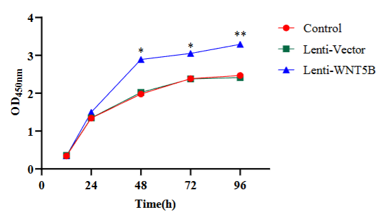
    - 过表达WNT5B试验中**转染`48H`后Lenti-WNT5B组的$OD_{450mm}$应该显著高于其他两组**

!!! error 干扰WNT5B——si-WNT5B
    - 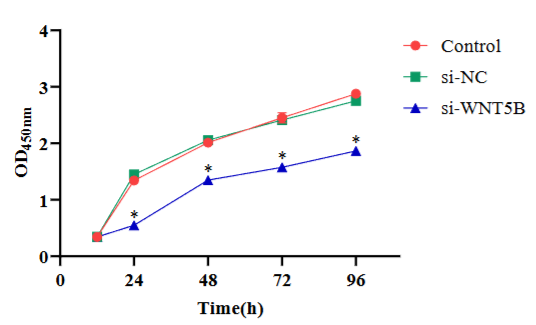
    - 干扰WNT5B试验中**转染`24H`后si-WNT5B组的$OD_{450mm}$应该显著低于其他两组**

### 五、EdU试验
用 $P_2$  MSCs，按 $3×10⁴$ cells/孔密度接种于 48 孔板（500 μL 完全培养基/孔），37°C、5% CO₂培养至 80%融合度转染 Lenti-WNT5B（试验组 n=3）、Lenti-Vector（空载组 n=3）和 Control（对照组 n=3），转染 `24 h` 后更换正常培养基，继续培养至 `48 h`。

!!! info 过表达WNT5B——Lenti-WNT5B
    - 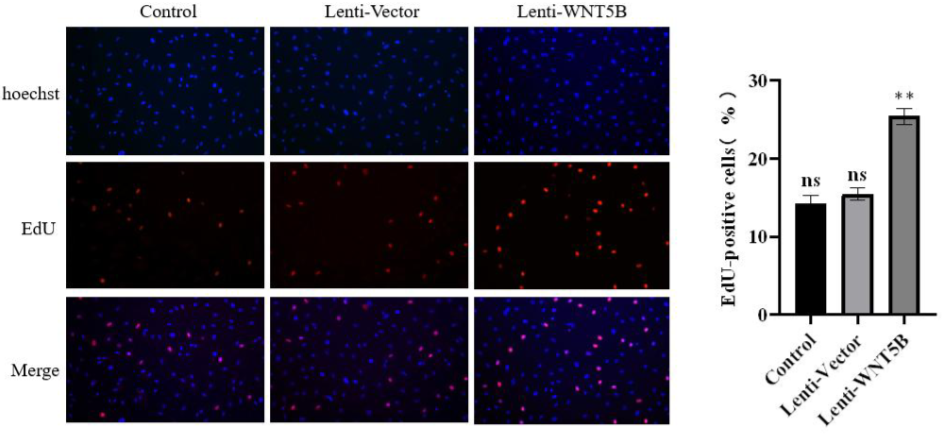
    - 过表达WNT5B试验中**转染`48H`后Lenti-WNT5B组的$EdU_{细胞阳性率}$应该显著高于其他两组**

!!! error 干扰WNT5B——si-WNT5B
    - 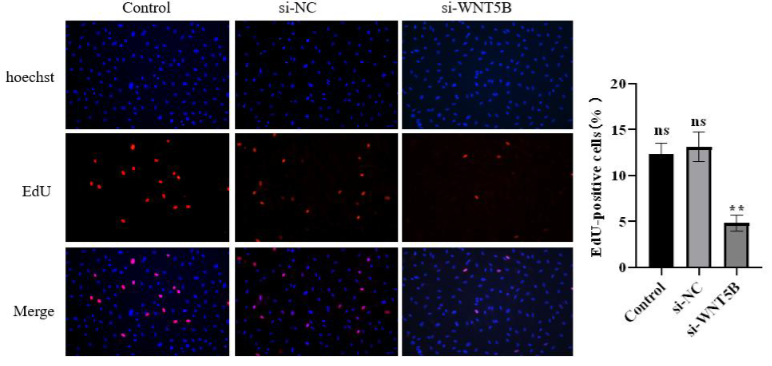
    - 干扰WNT5B试验中**转染`48H`后si-WNT5B组的$EdU_{细胞阳性率}$应该显著低于其他两组**

### 非经典WNT/CPC通路
实验结果表明：
WNT5B 过表达显著增强其增殖能力，并伴随非经典 WNT/PCP信号通路关键分子 ROR2、CDC42、RAC1、JNK 的基因表达水平上调；反之，通过抑制 WNT5B 表达，鹿茸 MSCs 的增殖能力显著减弱，且上述通路相关基因表达同步下调。
即： **WNT5B 通过激活非经典 WNT/PCP 信号通路正向调控鹿茸 MSCs 的增殖活性。**
*在此处只做了几个通路因子的基因表达差异，下一个实验中做蛋白质的验证*
## WNT5B 对鹿茸 MSCs 成骨分化的影响及调控机制
---
### 一、过表达/干扰WNT5B([方法同上个实验](#一试验前鉴定))
!!! info 过表达WNT5B——Lenti-WNT5B
    1.成骨分化标志物表达量
    - 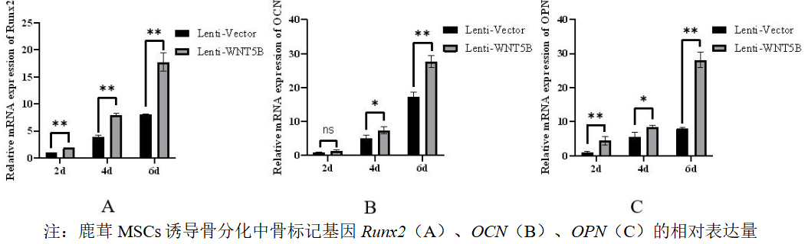
    - **Runx2** 和 **OPN**在过表达后`2d`就在两组之间出现显著差异。
    - **OCN**基因在过表达`4d`后出现出现两组间显著差异。

    2.成纤维细胞标志物表达量
    - 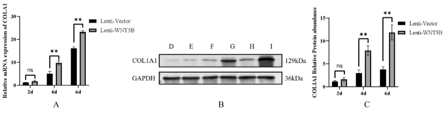
    - 转染`4d`后，COL1A1的基因表达量和蛋白质表达量均出现组件极显著差异

    3.WNT/PCP途径通路基因的表征
    - 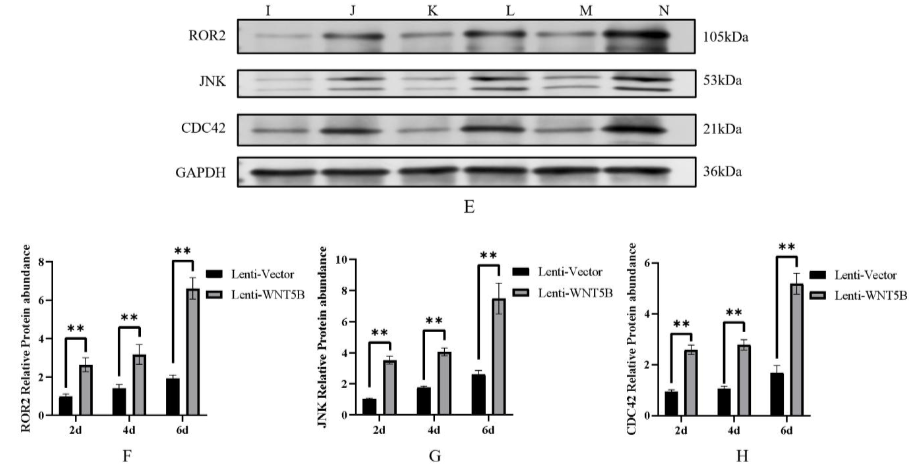

!!! error 干扰WNT5B——si-WNT5B
    1.成骨分化标志物表达量
    - 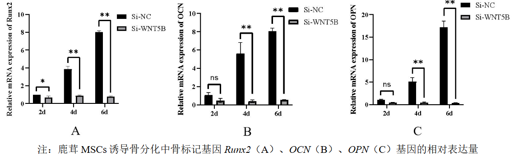
    - **Runx2**在干扰后`2d`就在两组之间出现显著差异。
    - **OPN**和**OCN**在干扰后`4d`出现两组之间的显著差异。
    2.
    - 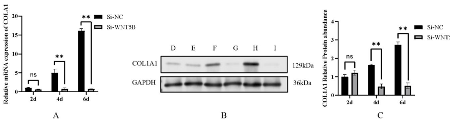
    - 转染`4d`后，COL1A1的基因表达量和蛋白质表达量均出现组件极显著差异
    3.WNT/PCP途径通路基因的表征
    - 

### 二、诱导MSCs成骨分化
取 $P_2$ MSCs，按 $1×10⁵$ cells/孔密度接种于 6 孔板（2mL 完全培养基/孔）；
|事件|试验组（慢病毒转染组n=3）|对照组（未转染/空载体组n=3）|
|---|---|---|
|37°C、5% CO₂培养 细胞融合度60%|MOI=50 加入 Lenti-WNT5B 慢病毒|加入对照病毒|
|37°C、5% CO₂ 孵育 6 h|弃病毒液，置换为成骨诱导培养基|同左|
|转染后24h|倒置荧光显微镜观察转染效率|同左|
- 每 `36H` 半量换液一次。
- 成骨诱导培养基 含 10% FBS、10 mM β-甘油磷酸钠、50 μg/mL 抗坏血酸、100 nM 地塞米松
### 三、RNA提取(细胞选取同上个试验)
### 四、RT-qPCR & WB
- RT-qPCR：
    过表达组（Lenti-WNT5B）、干扰组（Si-WNT5B）及空载组（Lenti-Vector、Si-NC）细胞，分别于成骨诱导后 `2d`、`4d`、`6d`（n=3）收集样本
- WB：同上个试验
### ALP染色试验
（1）弃原培养基，用 PBS 洗 3 次，每次 5 min
（2）用细胞固定液固定 20 min，PBS 洗 3 次，每次 5 min
（3）BCIP/NBT 染色工作液染色 30 min，室温避光
（4）蒸馏水洗 3 次，每次 5 min，显微镜下观察拍照。
实验结果：
- 在过表达试验中`2d`、`4d`、`6d`过表达组的ALP染色光密度和ALP基因表达量两个层面均出现显著高于对照组。
- 干扰试验中`4d`、`6d`过干扰组的ALP染色光密度和ALP基因表达量两个层面均出现显著低于对照组，`2d`时无显著差异。