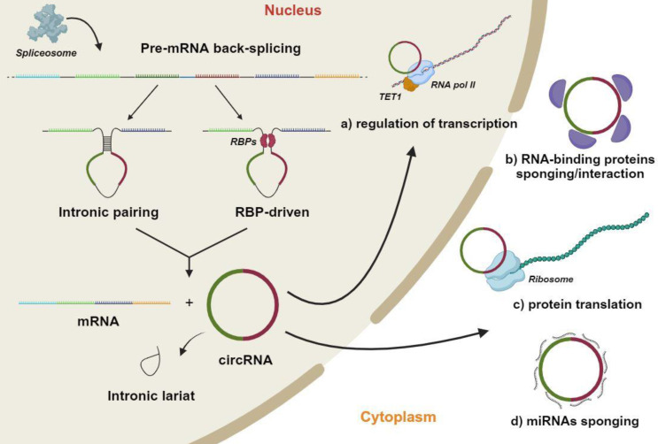
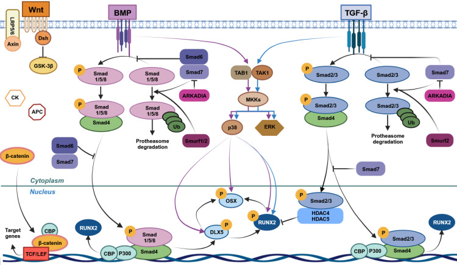
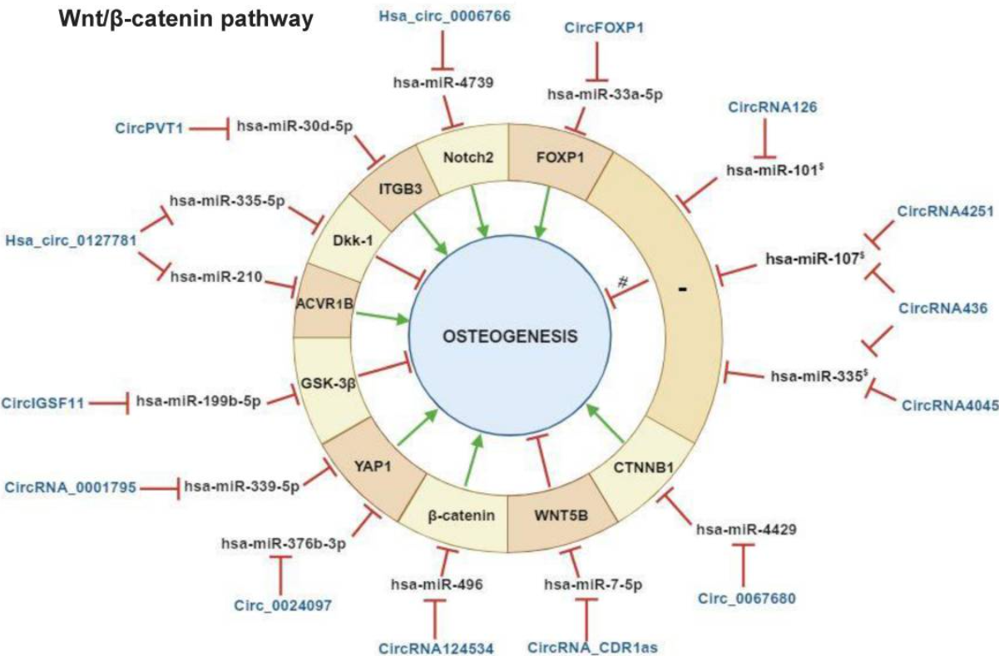
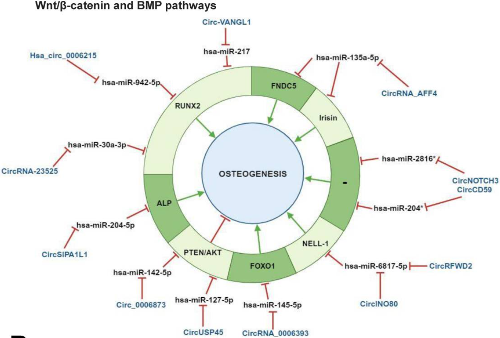
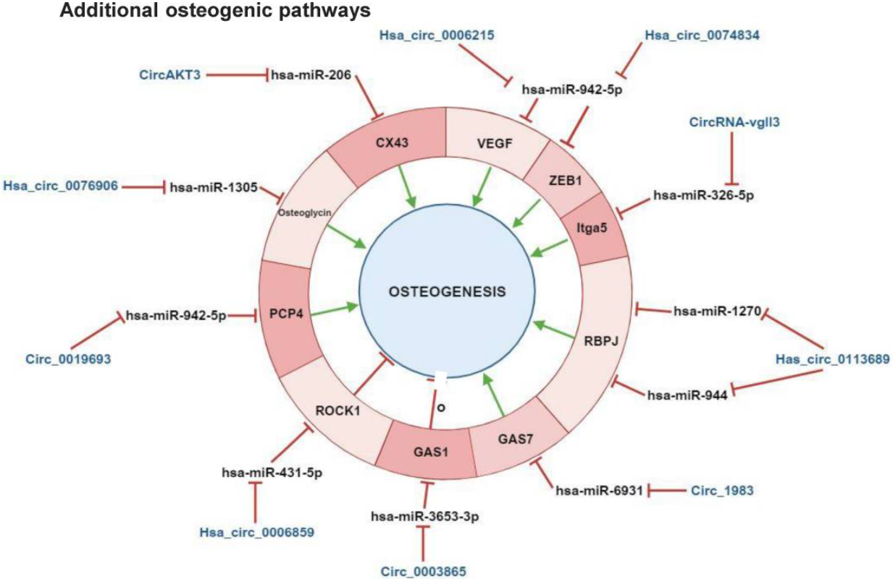

# circRNA在间充质干细胞成骨分化中的调控机制研究报告
[Regulatory mechanisms of circular RNAs during human mesenchymal stem cell osteogenic differentiation](https://pmc.ncbi.nlm.nih.gov/articles/PMC10750202/)

## 背景

环状RNA（circular RNA, circRNA）是一类由“反向剪接（back-splicing）”产生、5′端与3′端以共价键闭合成环的单链RNA，通常缺乏真核线性mRNA典型的5′cap与3′poly(A)尾，因此对外切核酸酶更耐受、总体更稳定，并可按来源/结构分为外显子circRNA（ecircRNA）、内含子circRNA（ciRNA）与外显子-内含子circRNA（EIciRNA）等亚型。

基于在人类间充质干细胞（hMSCs）成骨分化领域的综述，现有证据最集中支持：circRNA在成骨分化中主要通过竞争性内源RNA（ceRNA）框架发挥作用——“吸附/海绵化”特定miRNA，解除miRNA对下游靶基因的抑制，从而改变Wnt/β-catenin、BMP/TGF-β-Smad、PTEN/AKT、NOTCH、VEGF等通路节点与成骨主调控因子（尤其RUNX2）的表达，最终影响成骨表型与骨病进展（骨质疏松、股骨头坏死等）。

> ceRNA框架
竞争性RNA框架是指所有RNA之间通过miRNA进行简介交流的理论框架
所有的RNA都通过MREs(miRNA response elements)与miRNA作用简介调控某RNA的表达情况，而circRNA功能之一就是作为miRNA sponge解决这个问题。

需要强调两点“方法学与因果推断”风险：其一，circRNA鉴定高度依赖回剪接位点（BSJ）读段与RT-PCR验证，算法与实验偏差可造成假阳性/假阴性；其二，miRNA“海绵效应”对分子计量关系要求苛刻，生理条件下并非总能满足，因此应在鲁棒实验设计与多手段验证框架下解读“circRNA—miRNA—mRNA”轴。

---

## circRNA的定义、发生、结构类型与功能图谱

### 生物发生与分子结构要点

circRNA通常在细胞核内产生：单个基因位点的pre-mRNA在剪接体参与下发生**反向剪接（back-splicing）**，即下游外显子（或剪接位点）与上游剪接位点“逆序连接”，形成共价闭合的环状分子。

成环的常见促进机制可概括为两类：  
一类是**侧翼内含子互补配对（intronic pairing）**，通过形成二级结构把远距离剪接位点拉近；另一类是**RNA结合蛋白（RBP）驱动（RBP-driven）**，RBP结合侧翼序列并促进回环构象从而提高反向剪接概率。

结构上，circRNA通常缺乏游离5′与3′末端（常被表述为缺乏5′cap与3′poly(A)尾的线性结构特征），因此更难被外切核酸酶降解、整体半衰期更长；在该综述所概括的人类细胞背景中，成熟circRNA平均长度约550 nt、半衰期约48 h（不同细胞/分子与检测体系会有差异）。

### 类型与亚细胞定位

主流分类将circRNA分为三大类：  
- **ecircRNA**：主要由外显子组成，常见于细胞质，功能研究最集中；  
- **ciRNA**：来源于内含子，可在细胞核富集并参与转录层面调控；  
- **EIciRNA**：同时包含外显子与保留内含子片段，往往更偏核内定位，可通过与U1 snRNP等形成剪切复合体而影响亲本基因转录。

### 功能谱系：从ceRNA到蛋白翻译

以机制层面归纳，circRNA已被报道可：  
- 作为**miRNA海绵/ceRNA**，降低miRNA对靶mRNA的抑制，从而上调靶基因表达；  
- 与**RBP**结合，充当“蛋白诱饵/海绵/支架”，影响剪接、转录或蛋白复合体组装；  
- 在部分情况下具备**cap非依赖性翻译**潜力：在缺乏5′cap与3′poly(A)尾的前提下，依赖IRES、m6A等内部起始机制或回剪接后沉积的RNA加工相关复合体促进核糖体装载并产生肽段/蛋白。  

但就“人类MSC成骨分化”这一特定语境，综述明确指出：目前文献中被系统性报道、证据最集中的仍是**ceRNA/miRNA海绵**这一条主线，其他机制在成骨领域尚需更深入验证与拓展。

---

## 与mRNA、miRNA、lncRNA的系统比较

下表从“结构、发生、定位、稳定性、功能、翻译潜力与检测手段”对四类RNA做并列对比，便于把circRNA放在更大的RNA调控框架里理解。

| 维度 | circRNA | mRNA | miRNA | lncRNA |
|---|---|---|---|---|
| 典型长度 | 多为数百nt，综述给出平均~550 nt（范围可从<100 nt到>kb级） | 通常为数百到数千nt不等（基因与UTR差异大） | 成熟miRNA约~22 nt；pri-/pre-miRNA更长 | 定义上>200 nt，长度跨度极大 |
| 主要定位 | ecircRNA多在细胞质；ciRNA/EIciRNA偏核内 | 成熟mRNA多输出至细胞质参与翻译，也可在细胞核加工/输出阶段短暂停留 | 主要在细胞质通过RISC调控mRNA，也可存在核内功能 | 核内与细胞质均可分布，部分与核糖体/多核糖体相关 |
| 末端结构 | 共价闭合环；缺乏游离5′/3′末端（常表述为无5′cap与3′poly(A)尾） | 真核典型结构：5′cap与3′poly(A)尾形成“闭环翻译”协同调控翻译与稳定性 | 单链小RNA，不具备mRNA式cap与poly(A)尾结构 | 多由Pol II转录，常可剪接、加帽、加尾（具体依分子而异） |
| 生物发生 | 核内反向剪接；由内含子互补配对或RBP促进回环 | Pol II转录后经历剪接、加帽、加尾等成熟化加工 | pri-miRNA经微处理复合体加工为pre-miRNA，输出到胞质后经Dicer等成熟，并装载至AGO形成RISC | 多为Pol II转录产物，发生与mRNA相似但不编码蛋白或编码能力弱/争议 |
| 稳定性 | 普遍更稳定、对外切核酸酶更耐受；半衰期常长于线性同源转录本（多文献给出>48 h量级或在不同体系中更长/更短） | 稳定性高度可变，poly(A)尾与cap状态、去腺苷化/去帽等决定降解动力学 | 相对稳定但受修饰、结合蛋白与细胞环境影响；其功能依赖RISC | 稳定性差异大；部分lncRNA可被快速降解或受翻译相关机制影响 |
| 代表性功能 | ceRNA/miRNA海绵；RBP诱饵/支架；转录/剪接调控；部分可翻译 | 编码蛋白；同时UTR与结合蛋白调控定位、翻译效率与降解 | 通过识别靶mRNA序列抑制翻译或促降解；可成为网络“枢纽调控因子” | 染色质/转录调控、分子支架、与蛋白/核酸互作、ceRNA等 |
| 翻译潜力 | 传统上视为非编码，但部分circRNA可通过IRES/m6A等内部起始机制翻译出肽段/蛋白 | 主要翻译模板；cap与poly(A)协同促进起始与稳定 | 不翻译 | 多数不翻译（但“是否完全无编码潜力”在不同lncRNA上存在边界与争议） |
| 常用检测/定量方法 | RNA-seq识别回剪接位点（BSJ）读段；RT-PCR/RT-qPCR使用“发散引物（divergent primers）”跨越BSJ验证；RNase R富集/验证；Northern blot、BSJ特异探针（nanoString、BaseScope等） | Poly(A)+ RNA-seq或rRNA去除后RNA-seq；RT-qPCR（收敛引物）；Northern blot等 | small RNA-seq；茎环引物RT-qPCR（TaqMan等）；Northern blot、芯片等 | RNA-seq（poly(A)+或rRNA去除策略取决于lncRNA类型）；RT-qPCR；原位杂交等 |

---

## 论文中出现的全部circRNA机制与信号通路整合

### 通路框架与“成骨主干节点”

该综述将hMSC成骨分化的核心通路框架概括为Wnt/β-catenin与BMP/TGF-β信号，并强调二者在RUNX2等主调控因子处的汇聚；此外，文章进一步纳入成骨-血管生成耦联（VEGF相关）、NOTCH转录因子（RBPJ）、PTEN/AKT、生物材料/激素刺激相关轴等“扩展通路”。

在具体分子机制上，综述总结的大多数轴符合统一抽象结构：  
**circRNA（↑/↓） →（海绵化）miRNA →（解除抑制）靶mRNA/蛋白 →（改变通路活性）→ 成骨表型变化**。

### circRNA—miRNA—靶基因—通路汇总表

下表整合综述**Table 1**与对应正文叙述：列出每个circRNA、靶向miRNA、下游靶基因及其归属通路，并标注细胞来源与对成骨的方向性（大多来自体外模型，少数包含体内验证）。

| 通路模块 | circRNA | 细胞/来源 | 对成骨影响 | miRNA靶点 | 下游靶mRNA/蛋白 | 备注 |
|---|---|---|---|---|---|---|
| Wnt/β-catenin | circIGSF11 | BMSCs | ↓ | miR-199b-5p | GSK-3β | 综述指出抑制成骨；沉默circIGSF11促进分化 |
| Wnt/β-catenin | hsa_circ_0127781 | BMSCs | ↓（作用不清晰） | miR-335-5p；miR-210 | Dkk-1；ACVR1B | 综述明确“角色仍需进一步研究” |
| Wnt/β-catenin | circ_0024097 | BMSCs | ↑ | miR-376b-3p | YAP1 | YAP1与β-catenin互作，推动Wnt激活 |
| Wnt/β-catenin | circRNA_0001795 | BMSCs | ↑ | miR-339-5p | YAP1 | 与骨质疏松相关病理轴之一 |
| Wnt/β-catenin | circPVT1 | BMSCs | ↑ | miR-30d-5p | ITGB3 | ITGB3与β3整合素介导Wnt/β-catenin活化 |
| Wnt/β-catenin | hsa_circ_0006766 | BMSCs | ↑ | miR-4739 | NOTCH2 | 同时提示潜在骨质疏松临床意义 |
| Wnt/β-catenin | circ_0067680 | BMSCs | ↑ | miR-4429 | CTNNB1 | 直接指向β-catenin编码基因 |
| Wnt/β-catenin | circRNA_CDR1as | BMSCs（SONFH） | ↓ | miR-7-5p | WNT5B | 抑制成骨、促进脂肪分化倾向 |
| Wnt/β-catenin | circRNA_0001052 | BMSCs | 成骨作用未定 | miR-124-3p | （未给出） | 主要证据指向“增殖调控”，成骨可能性待研究 |
| Wnt/β-catenin | circRNA4251 | PDLSCs（机械力） | ↓（预测） | miR-107* | — | 计算预测，需实验验证 |
| Wnt/β-catenin | circRNA126 | PDLSCs（机械力） | ↓（预测） | miR-101* | — | 计算预测 |
| Wnt/β-catenin | circRNA4045 | PDLSCs（机械力） | ↓（预测） | miR-335* | — | 计算预测 |
| Wnt/β-catenin | circRNA436 | PDLSCs（机械力） | ↓（预测） | miR-107*；miR-335* | — | 计算预测 |
| Wnt/β-catenin | circFOXP1 | ASCs | ↑ | miR-33a-5p | FOXP1 | 含体内/体外证据（综述归纳） |
| Wnt/β-catenin | circRNA124534 | DPSCs | ↑ | miR-496 | β-catenin | 直接指向Wnt轴核心节点 |
| BMP/Smad | hsa_circ_0016624 | BMSCs | ↑ | miR-98 | BMP2 | 与骨质疏松抑制相关 |
| BMP/Smad | circ_0000020 | BMSCs | ↑ | miR-142-5p | BMP2 | 解除对BMP2的抑制 |
| BMP/Smad | circRNA_0048211 | BMSCs | ↑ | miR-93-5p | BMP2 | 解除对BMP2的抑制 |
| BMP/Smad | circRNA_33287 | MSMSCs | ↑ | miR-214-3p | RUNX3 | 文中指出体内促进异位成骨证据 |
| BMP/Smad | circFAT1 | PDLSCs | ↑ | miR-4781-3p | SMAD5 | 促进牙周组织再生相关成骨 |
| BMP/Smad | circRNA_CDR1 | PDLSCs | ↑ | miR-7 | GDF5 | 促进Smad1/5/8磷酸化（综述总结） |
| BMP/Smad | circPOMT1 | ASCs | ↓ | miR-6881-3p | SMAD6 | miR-6881-3p原本抑制BMP通路抑制子；被海绵化后“抑制子上调”导致负效应 |
| BMP/Smad | circMCM3AP | ASCs | ↓ | miR-6881-3p | Chordin（及/或SMAD6） | 与上条共同构成“负调控轴” |
| BMP/Smad | hsa_circ_0026827 | DPSCs | ↑ | miR-188-3p | Beclin1；RUNX1 | 连接自噬/成骨信号与转录因子 |
| BMP/Smad | circLPAR1 | DPSCs | ↑ | miR-31 | SATB2 | SATB2驱动下游促成骨基因表达 |
| Wnt+BMP汇聚 | hsa_circ_0006215 | BMSCs | ↑ | miR-942-5p | RUNX2 | 同时参与成骨-血管耦联（见下） |
| Wnt+BMP汇聚 | circ-VANGL1 | BMSCs | ↑ | miR-217 | RUNX2 | 低表达与骨质疏松进展相关（综述归纳） |
| Wnt+BMP汇聚 | circRUNX2 | BMSCs | ↑ | miR-203 | RUNX2 | 综述归纳为抗骨质疏松轴之一 |
| Wnt+BMP汇聚 | circRNA_AFF4 | BMSCs | ↑ | miR-135a-5p | FNDC5/irisin | 连接FNDC5裂解产物irisin与MAPK促成骨作用 |
| Wnt+BMP汇聚 | hsa_circ_0006393 | BMSCs | ↑ | miR-145-5p | FOXO1 | 与骨量/增殖相关（综述归纳） |
| Wnt+BMP汇聚 | circUSP45 | BMSCs | ↓ | miR-127-5p | PTEN/AKT | 通过PTEN抑制AKT，抑制成骨；敲低circUSP45可促进成骨 |
| Wnt+BMP汇聚 | circ_0006873 | BMSCs | ↓ | miR-142-5p | PTEN/AKT | 与骨质疏松关联的抑制轴 |
| Wnt+BMP汇聚 | circRFWD2 | ASCs | ↑ | miR-6817-5p | NELL-1 | 与NELL-1诱导成骨相关 |
| Wnt+BMP汇聚 | circINO80 | ASCs | ↑ | miR-6817-5p | NELL-1 | 与上条并行轴 |
| Wnt+BMP汇聚 | hsa_circRNA-23525 | ADSCs | ↑ | miR-30a-3p | RUNX2 | 促ADSC成骨分化 |
| Wnt+BMP汇聚 | circSIPA1L1 | SCAPs | ↑ | miR-204-5p | ALP | 与骨老化/成骨标志物调控相关 |
| Wnt+BMP汇聚 | circNOTCH3 | PDLSCs | ↑（预测） | miR-204*；miR-2816* | — | hub circRNA，需功能验证 |
| Wnt+BMP汇聚 | circCD59 | PDLSCs | ↑（预测） | miR-2816*；miR-204* | — | hub circRNA，需功能验证 |
| 扩展通路 | hsa_circ_0074834 | BMSCs | ↑ | miR-942-5p | ZEB1；VEGF | 促进成骨-血管耦联 |
| 扩展通路 | circ_0019693 | BMSCs | ↑ | miR-942-5p | PCP4 | PCP4与钙沉积相关（综述引述） |
| 扩展通路 | hsa_circ_0113689（circ-DAB1） | BMSCs | ↑ | miR-1270；miR-944 | RBPJ | 连接NOTCH转录因素RBPJ |
| 扩展通路 | hsa_circ_0006859（外泌体） | BMSCs | ↓ | miR-431-5p | ROCK1 | 文中叙述出现miRNA编号表述不一致，但核心为“miR-431-5p/ROCK1轴+脂成分化倾向” |
| 扩展通路 | circ_0003865 | BMSCs | ↓ | miR-3653-3p | GAS1 | 与褪黑素处理相关实验背景 |
| 扩展通路 | circ_1983 | BMSCs | ↑ | miR-6931 | GAS7 | 与硅酸二钙材料刺激相关 |
| 扩展通路 | hsa_circ_0076906 | MSCs | ↑ | miR-1305 | Osteoglycin | 缓解骨质疏松潜力（综述归纳） |
| 扩展通路 | circAKT3 | DPSCs | ↑ | miR-206 | CX43 | 体内敲低可抑制矿化结节形成（综述归纳） |
| 扩展通路 | circRNA-vgll3 | ADSCs | ↑ | miR-326-5p | Itga5 | 通过整合素α5促进成骨 |

\* 预测：综述表格标注为计算预测或缺乏充分实验证据的相互作用。

## 论文图像逐图解析与生物学含义

为保证“看图能复述机制”，本节对综述全部四幅图逐一解释其构图逻辑、箭头语义与生物学指向。

### 图像信息总览表

| 图号 | 主要内容 | 读图关键 | 生物学指向 |
|---|---|---|---|
| Figure 1 | circRNA的生物发生与功能谱 | 两条成环路径（内含子配对 vs RBP驱动）；四类功能（转录调控、RBP互作、翻译、miRNA海绵） | circRNA并非单一“miRNA海绵”，但在成骨领域目前证据集中于ceRNA机制 |
| Figure 2 | MSC成骨分化的核心信号通路框架 | Wnt/β-catenin核转位；BMP/TGF-β的Smad依赖/非依赖支路；正负调控因子（Smad6/7、Smurf等） | 成骨“主干通路”决定RUNX2等关键转录程序，为后续circRNA调控节点提供地图 |
| Figure 3 | circRNA通过Wnt与BMP通路调控成骨的网络示意 | 红色“T”样抑制符号表示抑制/海绵化；环形外圈为靶基因节点；中心为成骨表型 | 不同细胞来源的circRNA通过不同miRNA/靶基因组合“汇聚”到成骨表型 |
| Figure 4 | Wnt+BMP汇聚节点与扩展通路网络 | A：RUNX2、PTEN/AKT、NELL-1等汇聚；B：VEGF耦联、RBPJ/NOTCH、ROCK1等扩展 | 成骨调控不止“成骨通路本身”，还包含血管耦联、力学/材料/激素等环境输入 |

!!! Figure 1：生物发生与功能——“从成环到多机制潜力”
    
    图左侧用“pre-mRNA back-splicing”作为起点，往下分两条路：  
    （1）**Intronic pairing**：侧翼内含子互补配对形成二级结构，使剪接位点靠近；  
    （2）**RBP-driven**：RBP结合侧翼内含子并促进回环构象。两者都导向circRNA生成，同时伴随线性mRNA与内含子套索（intronic lariat）等产物。

    图右侧用四个图标概括circRNA功能：  
    a）核内转录调控（例如通过影响RNA Pol II相关过程等）；  
    b）与RBP互作（“蛋白海绵/诱饵/支架”）；  
    c）cap非依赖性翻译潜力（核糖体图标）；  
    d）miRNA海绵（小环与miRNA图标）。

    对成骨领域的提示是：虽然图1列出多机制可能，但综述在结尾强调，**在人类成骨分化场景被反复报道并形成体系化证据链的仍主要是ceRNA/miRNA海绵机制**，其余机制更多处于“值得探索”的前沿方向。

!!! Figure 2：成骨分化主干通路——“RUNX2作为汇聚点的地图”
    图2把三条主轴并列：Wnt、BMP与TGF-β。阅读顺序建议从膜到核：
    
    - **Wnt/β-catenin**：Wnt/β-catenin 信号通路通过β-catenin 转位至细胞核，进而诱导靶基因（包括 RUNX2）的表达，从而促进 MSCs 的成骨分化。  
    - **BMP/TGF-β（Smad依赖）**：TGF-β和 BMP 通过与其各自受体结合，激活 Smad 依赖性和非依赖性信号通路。在 TGF-β的 Smad 依赖性信号通路中，Smad2/3 在配体-受体结合后被磷酸化，并与 Smad4 相互作用，进而迁移至细胞核。在细胞核内，该复合物与 CBP 和 P300 共激活因子相互作用，诱导 RUNX2 的表达。 Smad2/3 在不与 Smad4 相互作用的情况下，与 HDAC4/5 形成复合物，从而抑制 RUNX2 的表达。未磷酸化的 Smad2/3 会被泛素化降解。 
    在 BMP Smad 依赖性通路中，I 型和 II 型 BMP 受体（BMPR-I 和 BMPR-II）被其配体激活，导致 Smad1/5/8 磷酸化。这些分子与 Smad4 形成复合物并进入细胞核，作为靶基因（包括 RUNX2 和 Osterix (OSX)）的转录调控因子。未磷酸化的 Smad1/5/8 也会被泛素化降解。该 Smad 依赖性级联反应还包括 Smad6/7 和 Smurf1/2，它们是该通路的负调控因子。
    - **Smad非依赖支路（MAPK等）**：在不依赖于 Smad 的级联反应中，TGF-β/BMP 信号通路通过包含 TAK1-TAB 复合物、ERK 和 p38 的级联反应诱导 DLX5、RUNX2 和 OSX 磷酸化，从而促进成骨细胞的成熟和增殖。

    同时，图2明确展示负调控组件（例如Smad6/7、Smurf等）以及“促/抑”并存的调控逻辑：这为理解后续图3/图4中“同为海绵miRNA，但最终可能促成骨或抑成骨”提供基础（关键在于其解除抑制的靶基因是通路的正调点还是负调点）。

!!! Figure 3：Wnt与BMP模块的circRNA网络——“同一表型的多入口调控”
    图3分A、B两部分。其共同构图语言为：外围是circRNA与miRNA的抑制关系（红色“T”符号），内圈标出被miRNA调控的关键基因节点，绿色箭头汇入中心“OSTEOGENESIS”。
    
    
    - A（Wnt/β-catenin） 把GSK-3β、Dkk-1、CTNNB1、YAP1、WNT5B等作为节点，说明不同circRNA通过不同miRNA“入口”调到同一条Wnt主轴，从而改变成骨。典型例子是circPVT1—miR-30d-5p—ITGB3与circ_0067680—miR-4429—CTNNB1。
      
    - B（BMP）以BMP2、SMAD5/6、RUNX1/3、SATB2、GDF5、Chordin等为节点，揭示促进或抑制BMP信号的不同“杠杆点”。比如hsa_circ_0016624、circ_0000020、circRNA_0048211均指向“解除miRNA对BMP2的抑制”。  

    该图的生物学含义是：成骨分化不是单一路径“开/关”，而更像一个由多条ceRNA轴密集覆盖的调控网络；同一细胞类型（如BMSC）可同时存在多个circRNA轴，理论上具备协同或拮抗的可能（这也是后续实验需要解决的网络层面问题）。

!!! info Figure 4：Wnt+BMP汇聚与扩展通路——“成骨-血管耦联与疾病相关节点”

    图4A聚焦**Wnt与BMP汇聚节点**（例如RUNX2、PTEN/AKT、NELL-1、ALP、FOXO1、FNDC5/irisin等）。它把多条轴“收束”到更少的关键枢纽：
      
    - RUNX2相关的miRNA（miR-942-5p、miR-217、miR-203、miR-30a-3p）与多个circRNA相连，暗示RUNX2是成骨ceRNA网络的高频“终端节点”。  
    - PTEN/AKT作为“负向成骨/增殖”轴被显式标出，解释了为何circUSP45、circ_0006873等会表现为抑制成骨（解除miRNA抑制→PTEN上调→AKT受抑→成骨受限）。  
    
    图4B展示**扩展通路**：VEGF（成骨-血管耦联）、RBPJ（NOTCH相关转录因子）、ROCK1（细胞运动/分化平衡）、GAS1/GAS7（细胞周期/材料刺激相关）、Osteoglycin与Itga5等。其核心信息是：成骨分化受到“血管生成与微环境输入”的强烈影响，circRNA网络不仅调控成骨标志基因，还可调控成骨-血管耦联与“成骨 vs 脂分化”的谱系选择。

---

## 结构—机制—表型—生物学意义的综合叙述

circRNA之所以能在成骨分化中形成高密度调控网络，根源在其**共价闭合环结构**：缺乏游离末端使其更稳定、更易在细胞内累积，从而在时间尺度上更可能持续影响miRNA可用性或与蛋白因子互作；在广义层面，circRNA可通过miRNA海绵化、RBP互作、甚至cap非依赖性翻译等机制参与调控。 在 **综述（2024）** 所聚焦的人类MSC成骨分化语境中，已被系统性归纳与反复报道的主线机制仍是ceRNA：不同来源MSC（BMSC、PDLSC、DPSC、ASC、ADSC、SCAP等）中，上调或下调的circRNA通过吸附特定miRNA，解除其对RUNX2、BMP2、CTNNB1、SMAD5、SATB2、PTEN、VEGF等关键节点的抑制，进而重塑Wnt/β-catenin与BMP/TGF-β-Smad等“成骨主干通路”的输出，表现为矿化结节形成、成骨标志物上调或谱系偏移等表型；其中少数circRNA轴（如circRNA_CDR1as、circUSP45、circ_0006873、hsa_circ_0006859、circ_0003865等）则通过增强负调控节点或促进脂分化倾向而抑制成骨，提示其在骨质疏松、骨坏死等疾病中的潜在诊断/治疗价值。 然而，这一领域的临床转化仍面临关键挑战：成骨相关证据多来自体外模型、体内验证比例有限；circRNA鉴定与定量受算法与实验偏差影响显著；同时“miRNA海绵效应”的计量学前提并非总能满足，因此未来研究需要在更严格的检测标准、因果干预手段与动物模型体系中，验证这些ceRNA轴是否在生理与病理骨重塑中稳定成立，并探索ceRNA之外的RBP互作与翻译机制是否也在成骨场景中发挥重要作用。

---

## 参考文献

-  et al. (2024). *Regulatory mechanisms of circular RNAs during human mesenchymal stem cell osteogenic differentiation*. doi:10.7150/thno.89066.  
-  & Salzman J. (2016). *Detecting circular RNAs: bioinformatic and experimental challenges*. PMID:27739534.  
-  et al. (2022). *Best practice standards for circRNA research*.  
-  & Gorospe M. (2018). *Detection and Analysis of Circular RNAs by RT-PCR*.  
-  & Kim YK. (2024). *Molecular mechanisms of circular RNA translation*.  
-  et al. (2018). *Cytoplasmic functions of lncRNAs*（lncRNA>200 nt定义、定位与功能概述）.  
-  & Coller J. (2021). *Roles of mRNA poly(A) tails in regulation of eukaryotic gene expression*.  
-  et al. (2005). *Real-time quantification of microRNAs by stem-loop RT-PCR*. PMID:16314309.  
- Benesova S. et al. (2021). *Small RNA-Sequencing: Approaches and Considerations for miRNA Analysis*（miRNA长度、生物发生与检测方法综述）.  
-  等 (2015). 《环形RNA研究进展》（中文综述：结构、分类、反向剪接、稳定性等）.  
- Memczak S. et al. (2013). *Circular RNAs are a large class of animal RNAs with regulatory potency*. PMID:23446348.  
- Hansen TB. et al. (2013). *Natural RNA circles function as efficient microRNA sponges*. PMID:23446346.