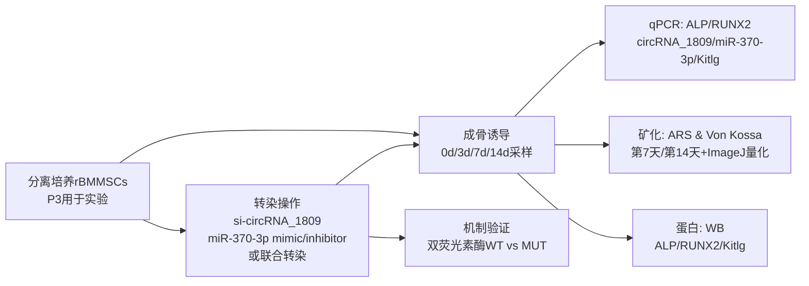
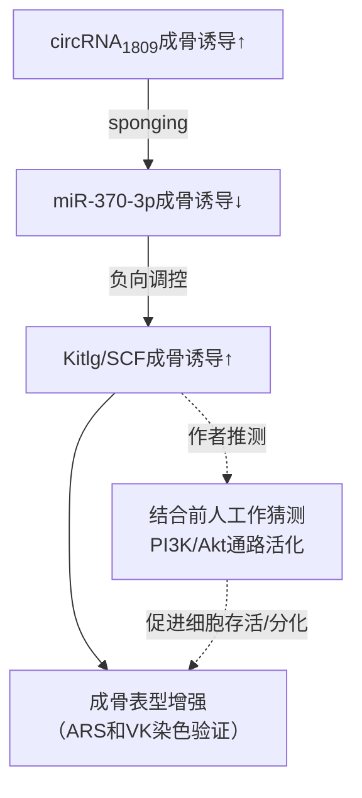

# circRNA_1809 通过 miR-370-3p/Kitlg 轴促进骨髓间充质干细胞成骨分化的实验研究解析
[CircRNA_1809 promotes the osteogenic differentiation of bone marrow mesenchymal stem cells through miR-370-3p](https://www.nature.com/articles/s41598-025-03711-3)
## 摘要
研究在大鼠骨髓间充质干细胞体外成骨诱导模型中发现：circRNA_1809随分化上调、miR-370-3p随分化下调；敲低circRNA_1809会降低Kitlg并抑制矿化，同时下调ALP/RUNX2；miR-370-3p过表达抑制成骨且可加重si-circRNA_1809表型；双荧光素酶支持circRNA_1809与miR-370-3p结合。整体证据链指向“circRNA_1809（海绵）→抑制miR-370-3p活性→上调Kitlg→促进成骨”，作者进一步推测可能牵涉PI3K/Akt通路。

## 背景与主要工作
骨缺损在临床较常见，自体骨移植被认为是治疗“金标准”，但受供骨量有限、供区损伤和术后并发症等限制，难以修复超过临界大小（critical size）的骨缺损，这推动了再生修复与组织工程策略的发展。 其中，骨髓间充质干细胞（BMMSCs）因易获取、具多向分化潜能而被广泛用于骨组织工程；“提高干细胞成骨分化能力”被视为促进骨再生的关键方向。

成骨分化的评价通常结合多种指标：ALP常被用于反映早期成骨分化能力；RUNX2是驱动BMMSCs向成骨谱系分化的核心转录因子，其表达降低会伴随成骨能力下降。 近年来大量研究显示，非编码RNA可通过多种机制调控基因表达，进而影响细胞增殖、分化等过程。

circRNA是一类共价闭合环状的内源性非编码RNA，缺乏线性RNA的5′帽和3′poly(A)尾，因此通常更稳定，并可通过“miRNA海绵/ceRNA”等方式参与转录后调控。 本文所解析的研究发表于 ，作者团队在既往高通量测序与生信分析中构建了ceRNA网络，提出circRNA_1809/miR-370-3p/Kitlg 轴可能参与BMMSCs成骨分化；在此基础上，本研究通过敲低/过表达与体外成骨表型评估，验证该调控轴的方向性与功能关联，并提出Kitlg可能是关键下游分子（进一步推测其与PI3K/Akt相关）。 

## 术语解释
下表以“尽量通俗但不失准确”为原则，解释文中高频名词，并标注它们在本文证据链中的位置。

| 术语/缩写 | 通俗解释（抓住“它是什么”） | 在本文中的功能位置/如何被使用 |
|---|---|---|
| circRNA（环状RNA） | 由前体RNA发生“反向剪接”形成的闭环RNA分子，没有游离5′与3′末端，通常更稳定。 | 研究核心分子之一：观察其在成骨诱导过程中的动态表达，并通过敲低验证其对成骨表型的影响。 |
| miRNA（微小RNA） | 长度约20nt的小RNA，常通过与靶mRNA的互补配对抑制翻译或促进mRNA降解，从而“压低”靶基因表达。 | 研究核心分子之一：miR-370-3p被当作circRNA_1809的潜在结合对象（被“海绵化”），并作为Kitlg的负调控者。 |
| MRE（miRNA应答元件） | RNA分子上可与特定miRNA结合的序列位点；多个RNA若共享MRE，就可能“争夺”同一miRNA。 | 解释ceRNA/海绵机制的关键概念：作者通过“预测结合位点 + 双荧光素酶”支持circRNA_1809含有与miR-370-3p互作的序列基础。 |
| ceRNA（竞争性内源RNA机制） | 不是某一类RNA“物种”，而是一种调控机制：含相同MRE的RNA彼此竞争结合miRNA，从而间接影响彼此下游靶基因的表达。 | 本文逻辑框架：circRNA_1809被认为通过吸附miR-370-3p，减弱其对Kitlg的抑制，从而促进成骨分化。 |
| BMMSCs / rBMMSCs | BMMSCs：骨髓间充质干细胞；rBMMSCs：大鼠来源BMMSCs。其成骨分化受多条信号通路与关键转录因子网络调控。 | 本研究的实验材料：从大鼠骨髓分离培养、成骨诱导，并进行基因调控与表型检测。 |
| 成骨分化（osteogenic differentiation） | 干细胞逐步获得成骨细胞特征并形成矿化基质的过程；常用分子标志物与矿化染色联合评估。 | 研究表型终点：通过矿化（ARS/Von Kossa）与ALP、RUNX2表达量变化来衡量。 |
| ALP | 碱性磷酸酶，常用于反映早期成骨分化能力。 | 作为成骨标志物：在时间序列、敲低/过表达、救援实验中均被qPCR/WB检测。 |
| RUNX2 | 成骨谱系关键转录因子，驱动成骨相关基因表达与矿化进程。 | 作为成骨标志物：用于评估circRNA与miRNA操作对成骨程序的影响。 |
| ARS（茜素红染色） | 与钙盐结合，常用于观察/定量细胞外基质钙化结节（矿化程度）。 | 主要矿化终点之一：在第7天与第14天进行染色并用ImageJ量化面积百分比。 |
| Von Kossa染色 | 通过银离子与磷酸盐/碳酸盐沉积反应显示矿化基质，常用于评价基质矿化。 | 另一矿化终点：与ARS相互印证“真正矿化”是否增加/减少。 |
| siRNA / si-circRNA | siRNA是一类用于降低特定RNA表达的小干扰RNA；文中用“si-circRNA_1809”实现circRNA_1809敲低。 | 关键因果工具：通过敲低circRNA_1809观察成骨表型改变，并与miR-370-3p mimic/inhibitor联用做“救援/加重”验证上下游关系。 |
| mimic / inhibitor | mimic：模拟miRNA、提高其功能；inhibitor：抑制miRNA、降低其功能。 | 用于证明miR-370-3p在成骨中是“负调控”，以及其是否位于circRNA_1809下游。 |
| 双荧光素酶报告（dual-luciferase assay） | 将候选结合序列克隆到报告载体中，观察miRNA是否能特异降低报告信号（WT vs MUT）。 | 关键“直接互作证据”：WT序列在miR-370-3p mimic作用下信号下降而MUT不受影响，用于支持circRNA_1809与miR-370-3p结合。 |
| Kitlg（又名SCF）/ c-Kit | Kitlg是c-Kit受体的配体，也称干细胞因子（SCF）；与细胞分化和生存相关。 | 被提出为miR-370-3p的下游靶基因；其在成骨诱导中上调，并受miR-370-3p与circRNA_1809操作影响。 |
| PI3K/Akt通路 | 经典细胞内信号网络之一，广泛参与细胞增殖、生存与分化调控；在成骨调控网络中也被频繁讨论。 | 本文属于“推测层”：作者基于既往富集分析与文献提出Kitlg可能通过PI3K/Akt促进成骨，但未在本文直接检测该通路活化。 |

## 按目的重构的实验报告
本部分将原文“方法—结果—讨论”按“目的→实验设计→实验结果→结论/逻辑”重排，便于您沿因果链理解。

**总体实验框架与统计策略（为后续每个实验提供共同背景）**  
研究对象为rBMMSCs：作者从4周龄雄性SPF级SD大鼠（约80–100 g）分离骨髓细胞并培养，成骨诱导组加入成骨分化培养基、对照组为常规培养基，并按时间点收集细胞。 细胞在成骨诱导前通过流式检查表面标志并要求纯度/活性>90%，随后使用第三代细胞开展实验。 文中主要终点包括：矿化染色（ARS、Von Kossa）及其面积量化、成骨标志物ALP/RUNX2的mRNA与蛋白水平、以及机制相关分子（miR-370-3p、Kitlg）的表达变化与报告基因验证。 每项实验设置三次重复，采用正态性检验与t检验/秩和检验、以及单因素方差分析等；以P<0.05为显著。文中统计图多以“均值±SEM”展示，并用*、**表示显著性。

**关键实验与结论对照表（先给“总览”，再进入逐项叙述）**

| 实验目的 | 核心分组/对照 | 样本/时间点 | 主要读出 | 关键结果（方向性） | 统计显著性信息 |
|---|---|---|---|---|---|
| 建立分化时间序列与候选轴的表达趋势 | 成骨诱导时间序列（0/3/7/14天） | rBMMSCs；3/7/14天qPCR | ALP、RUNX2、circRNA_1809、miR-370-3p | ALP、RUNX2随诱导上升；circRNA_1809上升；miR-370-3p在诱导过程中下降（14天显著）。 | 图注给出*p<0.05、**p<0.01（未报告具体p值）。 |
| 验证circRNA_1809的功能性（是否促进成骨） | si-circRNA_1809 vs 对照载体 | rBMMSCs；矿化第7/14天；分子检测第14天 | ARS/Von Kossa面积；ALP/RUNX2（qPCR/WB） | 敲低circRNA_1809→矿化面积下降；ALP/RUNX2 mRNA与蛋白下降。 | 图注*p<0.05、**p<0.01；量化基于ImageJ“%Area”。 |
| 判定miR-370-3p在成骨中的作用方向 | miR-370-3p mimic、inhibitor、对照 | rBMMSCs；矿化第7/14天；分子检测第14天 | ARS/Von Kossa；ALP/RUNX2（qPCR/WB） | mimic→矿化与ALP/RUNX2下降；inhibitor→矿化与ALP/RUNX2上升。 | 图注*p<0.05、**p<0.01。 |
| 验证circRNA_1809与miR-370-3p的上下游关系与直接互作 |（1）si-circRNA_1809后miR变化；（2）WT/MUT报告载体+miR mimic；（3）联合转染救援 | rBMMSCs；（报告基因方法描述含293T） | qPCR；双荧光素酶；矿化与ALP/RUNX2 | si-circRNA_1809→miR-370-3p上升；WT报告信号被mimic抑制而MUT不受影响；si-circRNA_1809+inhibitor可部分“救回”成骨抑制表型，+mimic则加重。 | 图注*p<0.05、**p<0.01；作者提到某些对比下降“超过一半”。 |
| 评估Kitlg是否为miR-370-3p潜在靶点及其在轴中的位置 |（1）诱导时间序列；（2）miR mimic/inhibitor；（3）si-circRNA_1809与miR操作联合 | rBMMSCs；mRNA/蛋白在第14天等 | Kitlg mRNA（qPCR）、蛋白（WB） | Kitlg在成骨诱导中上升；miR mimic降低Kitlg、inhibitor升高Kitlg；si-circRNA_1809+miR mimic使Kitlg更低，+inhibitor相对提高。 | 图注*p<0.05、**p<0.01（多数结果未给具体p值）。 |

### 实验一：建立成骨诱导过程中的表达趋势
**目的**  
确认rBMMSCs成骨诱导是否成功，并观察circRNA_1809、miR-370-3p在分化进程中的动态变化，为后续因果实验提供“变化方向”。  

**实验设计**  
在成骨诱导后第3、7、14天进行qPCR，检测ALP、RUNX2、circRNA_1809与miR-370-3p。  

**样本/条件**  
rBMMSCs成骨诱导时间序列（文中以0d/3d/7d/14d呈现）。  

**实验结果**  
ALP与RUNX2随成骨诱导逐步上升；circRNA_1809呈逐渐上升趋势；miR-370-3p在诱导过程中下降，并在第14天出现显著下降。  

**统计显著性**  
图注标注*p<0.05、**p<0.01，但未提供具体p值。  

**结论/逻辑**  
在“成骨标志物上升”的背景下，circRNA_1809与成骨分化呈正向伴随，而miR-370-3p呈反向伴随，这为“circRNA_1809可能抑制miR-370-3p功能”的后续假设提供了起点。  

### 实验二：构建并验证干预工具（si-circRNA_1809、miR mimic/inhibitor）
**目的**  
确保后续因果实验中，circRNA_1809与miR-370-3p可以被稳定地“拉低/拉高”。  

**实验设计**  
构建si-circRNA_1809、miR-370-3p mimic与inhibitor并转染rBMMSCs；24小时后检测circRNA_1809，转染mimic/inhibitor后检测miR-370-3p表达变化。  

**样本/条件**  
第三代rBMMSCs；转染条件与试剂流程在方法学中描述。  

**实验结果**  
si-circRNA_1809组circRNA_1809显著低于对照；miR-370-3p mimic组miR表达显著升高，接近对照的两倍；miR-370-3p inhibitor组显著降低。  

**统计显著性**  
图注以*p<0.05、**p<0.01标注显著性。  

**结论/逻辑**  
干预工具有效，为“敲低/过表达→表型变化→救援验证”提供操作基础。  

**审慎提示（方法学一致性问题）**  
方法学部分给出的“si-circRNA_1809靶序列”与“miR-370-3p inhibitor靶序列”在文本中被写成相同序列（均为CGTGTCAGCAGTT），这在逻辑上较不寻常，可能是排版/录入错误；建议您阅读原文补充材料或联系作者核对实际序列与设计策略。  

### 实验三：敲低circRNA_1809是否抑制成骨表型
**目的**  
检验circRNA_1809是否为“促进成骨分化”的正调控因子。  

**实验设计**  
si-circRNA_1809 vs 对照载体；成骨诱导后第7天与第14天进行ARS与Von Kossa染色并定量；第14天检测ALP、RUNX2的mRNA（qPCR）与蛋白（WB）。  

**样本/条件**  
rBMMSCs；矿化量化使用ImageJ将阳性面积转为“%Area”。  

**实验结果**  
敲低circRNA_1809后：  
- 第14天ARS阳性面积低于对照，且差异较第7天更明显；Von Kossa显示基质矿化也在第7与第14天均显著降低。  
- 第14天ALP与RUNX2的mRNA表达显著降低；WB结果与qPCR一致，蛋白水平的ALP与RUNX2下降。  

**统计显著性**  
图2标注*p<0.05、**p<0.01。  

**结论/逻辑**  
“敲低→矿化减少+成骨标志物下降”的一致结果支持：circRNA_1809在该模型中与成骨能力正相关，且更可能处于促进成骨的上游调控位置。  

### 实验四：miR-370-3p在成骨分化中的作用方向
**目的**  
确认miR-370-3p究竟是促进还是抑制成骨，从而决定其在轴中的“符号”（正/负调控）。  

**实验设计**  
转染miR-370-3p mimic或inhibitor；在第7/14天进行ARS与Von Kossa；第14天检测ALP、RUNX2 mRNA与蛋白。  

**样本/条件**  
rBMMSCs成骨诱导；统计以图注符号表示。  

**实验结果**  
miR-370-3p过表达组：钙化结节数量与面积显著减少；ALP/RUNX2的mRNA与蛋白显著降低。miR-370-3p敲低组：钙化结节数量与面积增加；ALP/RUNX2表达升高。  

**统计显著性**  
图3标注*p<0.05、**p<0.01。  

**结论/逻辑**  
miR-370-3p在该系统中是“成骨抑制因子”。因此，如果circRNA_1809是上游促进因子，则其合理机制之一是“抑制miR-370-3p活性（例如海绵）”。  

### 实验五：证明“circRNA_1809通过miR-370-3p发挥作用”的关键证据链
本组实验是全文的“机制核心”，包含三个层面的证据：表达联动、直接互作、表型救援。

**目的**  
验证circRNA_1809与miR-370-3p存在上游—下游关系，并评估这种关系是否足以解释成骨表型。  

**实验设计与结果一：敲低circRNA_1809后miR-370-3p是否上升**  
敲低circRNA_1809后，未分化与成骨分化状态的rBMMSCs中，miR-370-3p表达均显著上升。  
**推论**：circRNA_1809在表达层面与miR-370-3p呈负相关，符合“海绵减少miR可用性/或影响其稳态”的总体方向，但仅凭此不足以证明直接结合。  

**实验设计与结果二：双荧光素酶验证直接结合（WT vs MUT）**  
作者预测circRNA_1809与miR-370-3p存在结合位点，并构建含该位点的WT与突变（MUT）报告载体；当与miR-370-3p mimic共同转染时，WT报告信号被明显抑制，而MUT不受影响。 方法学描述中报告载体构建后转染至293T细胞进行检测（结果部分叙述也提及在rBMMSCs中共转染），总体结论一致指向“序列依赖的互作”。  
**推论**：该结果提供了“直接互作”的强证据，支撑circRNA_1809可作为miR-370-3p结合平台。  

**实验设计与结果三：救援/加重实验（判断是否为关键通路）**  
si-circRNA_1809单独转染会抑制成骨；若联合miR-370-3p mimic，会进一步降低成骨能力；若联合miR-370-3p inhibitor，则可逆转si-circRNA_1809对成骨分化的抑制效应（至少部分恢复）。 在第14天分子层面，si-circRNA_1809+miR-370-3p mimic组的ALP与RUNX2表达相对si-circRNA_1809组“降低超过一半”，WB结果亦支持这种加重效应；相反，在miR-370-3p inhibitor背景下加入si-circRNA_1809，会削弱inhibitor对成骨的促进作用。  
**结论/逻辑**：  
- “inhibitor能救回si-circRNA_1809表型”符合“circRNA_1809位于miR-370-3p上游、并通过抑制miR发挥促进成骨作用”的因果结构；  
- “mimic能加重表型”进一步强化该通路在成骨调控中的解释力。  

### 实验六：将Kitlg纳入轴并定位其上下游位置
**目的**  
确定miR-370-3p是否影响Kitlg，以及circRNA_1809是否可通过miR-370-3p间接调控Kitlg，从而将“分子轴”与“表型”连接得更完整。  

**实验设计**  
作者以数据库预测miR-370-3p的潜在下游靶点，指出Kitlg存在潜在结合位点；随后在成骨诱导过程中检测Kitlg动态表达，并在miR mimic/inhibitor与si-circRNA_1809±miR操作条件下检测Kitlg mRNA与蛋白。  

**样本/条件**  
rBMMSCs；Kitlg在第14天进行WB，mRNA时间序列贯穿诱导至第14天。  

**实验结果**  
- Kitlg在成骨诱导过程中mRNA逐步升高，并且在成骨诱导培养基中培养的rBMMSCs，其第14天Kitlg蛋白水平显著高于常规培养基对照。  
- miR-370-3p inhibitor可上调Kitlg，而miR-370-3p mimic可下调Kitlg（mRNA与蛋白层面一致）。  
- si-circRNA_1809与miR-370-3p mimic共转染时Kitlg更低；与miR-370-3p inhibitor共转染时Kitlg相对升高。  

**统计显著性**  
图5同样以*p<0.05、**p<0.01标注显著性，且说明qPCR归一化至GAPDH、WB归一化至β-tubulin并用ImageJ定量。  

**结论/逻辑**  
上述结果支持“miR-370-3p负调控Kitlg”，并支持“circRNA_1809位于miR-370-3p上游、抑制其对Kitlg的靶向效应”。作者在讨论中也将Kitlg解释为c-Kit配体（亦称SCF），并据文献指出其与间充质干细胞成骨及造血调控相关。  
**但需要强调严谨性**：本文以“预测+表达变化”支持Kitlg为miR-370-3p靶点，措辞亦为“may be a direct target”；若要达到“直接靶向”的金标准，通常还需Kitlg 3′UTR的报告基因验证或更直接的结合证据。  

## 总体讨论与逻辑链整合
**文章核心因果链（证据强度按“观察→因果→机制→救援”递进）**  
1）**观察层**：成骨诱导成功（ALP/RUNX2上升），同时circRNA_1809上升、miR-370-3p下降。  
2）**因果层A（circRNA→表型）**：敲低circRNA_1809会降低矿化并下调ALP/RUNX2，支持其为成骨促进因子。  
3）**因果层B（miR→表型）**：miR-370-3p mimic抑制成骨、inhibitor促进成骨，确定其为负调控。  
4）**机制层（circRNA↔miR）**：双荧光素酶WT/MUT支持circRNA_1809与miR-370-3p序列依赖结合；敲低circRNA_1809后miR-370-3p上升。  
5）**救援层（关键判别）**：miR-370-3p inhibitor能部分逆转si-circRNA_1809抑制成骨的效应，而mimic会加重该效应，符合“上游海绵circRNA→下游miR”的经典ceRNA逻辑。  

**将作者讨论与外部知识点“对齐”**  
- “circRNA作为miRNA海绵”是circRNA研究中的经典机制之一：在中国综述中，circRNA被描述为稳定、富集的环状分子，其主要功能之一可作为miRNA海绵并参与转录后调控；ceRNA网络被简化为“circRNA吸附miRNA，使mRNA从miRNA抑制中释放”。 本文的“WT/MUT报告+救援实验”与这一机制框架高度一致，因而作者在讨论中明确将其解释为“分子海绵”。  
- Kitlg/SCF与成骨：作者指出Kitlg是c-Kit配体（SCF），并引用既往研究提示其参与成骨与造血调控；在本文中Kitlg随成骨诱导上升且受miR-370-3p强烈影响，因而被放入“circRNA_1809—miR-370-3p—Kitlg”的下游位置。  
- PI3K/Akt的定位：作者将PI3K/Akt作为“推测性桥梁”，其依据包括既往GO/KEGG富集提示该通路与差异表达circRNA/mRNA相关，以及文献提出Kitlg可通过PI3K/Akt促进细胞生存/增殖并参与分化过程。 就本文本身而言，PI3K/Akt并未用磷酸化水平或抑制剂实验直接验证，因此在因果链中应标记为“待检验环节”。  

## 工作与创新点总结、可能局限与后续研究建议
**文章工作与创新点（以“本研究相对既有文献增加了什么”为口径）**  
文章将既往高通量筛选得到的候选ceRNA轴，进一步落实为一条具备“功能—机制—救援”证据链的调控路径：circRNA_1809促进rBMMSCs体外成骨分化，且通过吸附miR-370-3p并上调Kitlg表达来实现。 与仅停留在表达关联或单向干预的研究相比，本研究至少在miR层面提供了较强的“救援/加重”验证，从而增强了“circRNA位于miR上游并通过其发挥作用”的可解释性。 另外，作者将Kitlg纳入轴并提出与PI3K/Akt相关的工作假设，为后续从“现象—机制—信号通路”进一步深化提供了可操作方向。  

**文章自述局限（作者明确指出）**  
作者在讨论中承认：目前证据主要停留在细胞层面；对该调控轴与其他信号通路的互作理解有限；尚未建立动物模型验证其在体内骨修复/再生中的作用。  

**基于全文证据链的进一步局限（在不超出论文事实前提下的审慎归纳）**  
- **“circRNA确为环状”的实验学佐证不足**：circRNA领域常用RNase R耐受、反向剪接位点验证、转录抑制后稳定性比较等来证明“成环”与“更稳定”；中文综述也指出RNase R处理常作为判定RNA是否成环的重要条件之一。 本文主要围绕功能/机制验证展开，但单篇中未见对circRNA_1809成环特性的系统验证描述（可能在既往工作或补充材料中）。  
- **miR-370-3p→Kitlg“直接靶向”仍偏推断**：本文使用靶点预测与mRNA/蛋白变化支持Kitlg为miR-370-3p潜在靶点，并在文本中使用“may be a direct target”。 若要更严谨地证明直接靶向，通常需要Kitlg 3′UTR双荧光素酶或RIP/pull-down等证据。  
- **通路层（PI3K/Akt）缺少直接检测**：作者将PI3K/Akt作为推测，但未直接测量Akt磷酸化或使用PI3K/Akt抑制剂/激动剂进行因果验证。  
- **方法学文本存在不一致/需核对之处**：双荧光素酶方法学中写到转染293T细胞，而结果段落叙述为与rBMMSCs共转染；此外，干预序列文本中出现“si-circRNA_1809与miR-370-3p inhibitor序列相同”的可疑点，均提示读者在复现实验或深度解读时应优先核对补充材料或原始设计。  

**后续研究建议（面向“把推测变成结论”）**  
- 体内层面：建立骨缺损/骨折愈合模型，在局部递送circRNA_1809干预（如AAV、外泌体或支架载体）后评估骨量、骨强度与组织学矿化，以检验其转化潜力。  
- 机制层面：补齐ceRNA证据的“硬件条件”，例如亚细胞定位（细胞质富集更符合海绵作用）、AGO2-RIP或生物素标记pull-down验证相互作用，并验证“circRNA_1809—miR-370-3p—Kitlg”在同一RISC相关背景下是否共现。  
- 靶点层面：构建Kitlg 3′UTR WT/MUT报告载体验证直接靶向，同时进行Kitlg功能救援（如在miR mimic背景下过表达Kitlg）以证明成骨表型是否由Kitlg介导。  
- 通路层面：检测PI3K/Akt关键节点（如p-Akt）并进行药理学阻断实验，检验作者提出的“Kitlg→PI3K/Akt→成骨”是否成立，避免将相关性误写为因果。