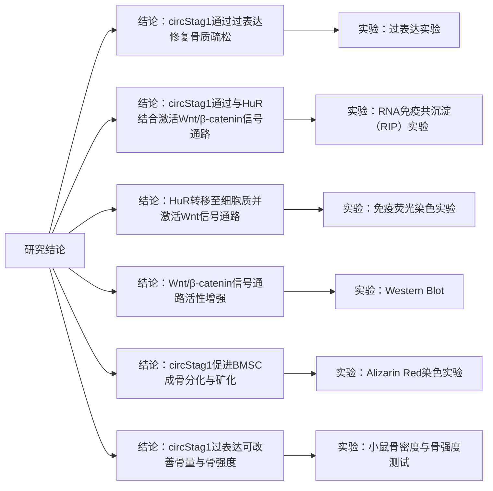

# circStag1–HuR–Wnt轴促进骨再生研究的重构式解读与方法学溯源报告
[Circular RNA circStag1 promotes bone regeneration by interacting with HuR](https://www.nature.com/articles/s41413-022-00208-x)
## 摘要

这篇发表于 **Bone Research** 的论文已于 **2024-06-24** 被正式撤稿；撤稿原因包括：文中存在多处“图像重叠”，以及“复用作者早期论文的数据”，作者称在整理大量图像材料时发生了无意混用，并表示将来会提交修订稿再审。 因此，下述对结果与机制的总结，应被视为“论文主张的复述与方法学框架梳理”，而不是可直接采信的结论（尤其是强依赖图像呈现的数据，如WB条带、染色图、显微图）。

论文的核心主张是：在绝经后骨质疏松相关模型与临床骨组织中，环状RNA **circStag1** 下调；上调 circStag1 可增强骨髓间充质干细胞（BMSC）的成骨分化。机制上，circStag1 与 RNA 结合蛋白 **HuR** 结合并促其从细胞核转位到胞质；胞质 HuR 进一步提高 **Lrp5/6** 与 **β-catenin** 表达，从而激活经典 **Wnt/β-catenin** 通路并促进成骨；体内用 AAV 递送 circStag1 可在卵巢切除（OVX）大鼠中减轻骨量丢失、改善骨微结构与力学指标。

从“可复现性”角度看：文章提供了多数关键实验的框架与部分参数（如RNA-seq筛选阈值、RIP与pulldown关键量、AAV剂量与微CT扫描参数等），但对若干结果对应的关键操作仍“未说明”（例如TRAP染色与血清CTX-I检测的具体试剂盒/步骤、H&E与未脱钙骨组织学的制片流程、随机化与盲法执行细节、原始数据共享）。

## 要点梳理

背景信息（来自摘要与引言的“问题场景”）  
绝经后骨质疏松被描述为常见代谢性骨病，特征包括骨微结构恶化、骨量降低与骨折风险升高；当前治疗以双膦酸盐等为主，但长期使用可能出现并发症，因此需要更多分子靶点与生物标志物。  
论文将“非编码RNA（ncRNA）尤其环状RNA（circRNA）”定位为潜在调控层：circRNA 因闭环结构更稳定，可通过 miRNA 海绵或与 RNA-binding proteins（RBPs）互作等方式调控疾病过程；在骨质疏松领域，既往工作多聚焦“miRNA海绵”，而“circRNA–RBP”机制在骨代谢中的作用仍不清楚。

研究问题（Research Question）  
在绝经后骨质疏松背景下：是否存在关键的骨质疏松相关 circRNA 能通过“与RBP互作（而非仅miRNA海绵）”调控BMSC成骨，从而影响骨再生/骨量？

核心假设（Hypothesis）  
circStag1 在骨质疏松中下调；恢复/上调 circStag1 能促进BMSC成骨分化；其分子机制依赖 circStag1 与 HuR 的结合与转位，进而通过稳定Lrp5/6与β-catenin等关键因子激活Wnt信号。

主要工作（Main Work）  
论文按“筛选—功能—机制—体内验证”的链条推进：  
其一，在OVX大鼠BMSC与临床骨组织中用RNA-seq与qPCR筛到 circStag1 作为下调且与骨量/成骨指标正相关的候选。  
其二，在体外通过过表达/敲低验证 circStag1 促进成骨分化（ALP/ARS、成骨标志物）。  
其三，通过预测+RIP+RNA pulldown+定位实验提出 circStag1 结合HuR并促核外转位；再用HuR干预证明Wnt相关分子上调依赖HuR。  
其四，采用AAV体内递送 circStag1 于OVX大鼠，结合微CT、动态/静态骨组织形态计量、三点弯曲等指标评估骨量与骨力学改善。

## 结果到方法的对应与方法学检索

下表以“论文每条主要结果/图”为粒度，对应其使用的方法，并补充：方法原理、关键模型/参数、常见替代法、以及在“已撤稿”背景下的可信度评估（偏保守）。

### 方法–结果对应表

| 结果主张（对应图/段） | 方法名称 | 简要原理 | 关键试剂/模型/参数（文中给出） |
|---|---|---|---|
| OVX BMSC 成骨能力下降；筛到差异circRNA（Fig S1, Fig1a–c） | OVX大鼠模型+BMSC分离培养；RNA-seq筛circRNA；差异分析+KEGG富集 | OVX模拟雌激素缺乏；RNA-seq在去除rRNA与线性RNA后富集circRNA信号；生信工具识别反向剪接位点；KEGG对宿主基因/相关基因做通路富集 | 雌性SD大鼠8周龄；sham与OVX各n=10；RNA-seq样本n=3；差异阈值P<0.05且FC≥2；识别工具：CIRI2与CIRCexplorer2；KEGG富集  | 
| circStag1在OVX BMSC与临床骨组织下调，且与T-score/成骨标志物正相关（Fig1d–h, Fig2） | qPCR定量；Pearson相关 | qPCR基于荧光染料定量转录本；相关分析评估线性相关强度 | 临床样本：绝经后女性脊柱融合术骨组织；骨量用T-score；骨组织取100 mg；qPCR平台与内参：Gapdh/U6；Pearson相关；报告R=0.8996  | 
| circStag1为Stag1外显子来源环状RNA；不影响线性Stag1表达（Fig3a–g） | Sanger测序验证反向剪接位点；过表达/siRNA干预；qPCR+WB检测线性/蛋白 | Sanger在扩增产物中直接读出“back-splice junction”；干预后测线性mRNA与蛋白验证是否“宿主基因效应” | 
| circStag1主要位于胞质（Fig3h–j） | RNA-FISH；细胞核/胞质分离+qPCR | FISH用荧光探针定位RNA；分离法用核标记/胞质标记验证分离纯度后做qPCR | FISH：37°C杂交16h；探针：circStag1 back-splice junction；显微：Leica DMi8；分离+qPCR（内参如U6/18S常作核/胞质对照） |
| 过表达circStag1增强、敲低削弱BMSC成骨分化（Fig3k–p） | 成骨诱导；ARS矿化结节染色；ALP染色；成骨标志物qPCR+WB | 成骨诱导促分化；ARS结合钙盐显示矿化；ALP为早期成骨标志；qPCR/WB对分子水平佐证 | 成骨培养基成分：10%FBS、抗坏血酸50 μg/mL、β-甘油磷酸10 μM、地塞米松0.1 μM、谷氨酰胺10 μM；2天换液；ARS：pH8.3染30min；ALP：BCIP/NBT；ImageJ量化  |
| 预测并验证circStag1与HuR互作；突变结合位点削弱互作（Fig4a–e） | RBPDB+CircInteractome预测；RNA结构建模；HADDOCK分子对接；RIP；RNA pulldown | 数据库基于已知RBP结合基序/CLIP数据给出潜在位点（需实验验证）；RIP免疫沉淀RBP并检测共沉淀RNA；pulldown以生物素RNA为诱饵捕获蛋白 | 
| circStag1不改变HuR总量，但促HuR核→胞质转位（Fig4f–k） | 核/胞质分离WB；FISH+免疫荧光共定位 | 通过分馏比较核/胞质HuR含量；共定位观察空间分布变化 | 
| HuR可结合Lrp5/6与β-catenin mRNA；circStag1效应依赖HuR（Fig5） | RIP检测HuR–mRNA结合；HuR过表达/敲低；qPCR+WB；功能救援实验 | RIP用于验证HuR是否富集特定mRNA；救援实验判断因果链（circStag1→HuR→Wnt分子） | RIP同上；读出：Lrp5、Lrp6、β-catenin mRNA与蛋白；si-HuR共转染可消除circStag1效应  | 
| 体内AAV递送circStag1改善OVX骨量/骨微结构/骨形成与力学（Fig6–7） | AAV9构建与尾静脉注射；微CT；骨形态计量（静态+动态钙黄绿素双标）；三点弯曲；骨组织qPCR/WB/IF | AAV系统递送表达盒；微CT与骨形态计量量化骨小梁结构；双标计算MAR/BFR；三点弯曲评估骨强度 | AAV：n=6/组；剂量2×10^12 vg/rat/周×4周；calcein 10 mg/kg 于处死前9天与2天；微CT参数：100 μA、80 kVp、像素20 μm、曝光926 ms；三点弯曲：支点距20 mm、预载10 N、位移速率2 mm/min  | 
| AAV降低骨吸收：TRAP阳性破骨细胞减少、血清CTX-I下降（Fig S9） | TRAP染色；血清CTX-I检测（文中未给具体方法） | TRAP为破骨细胞经典酶组织化学标志；CTX-I/β-CTX为I型胶原降解产物，反映骨吸收 | **未说明**：TRAP试剂盒/底物体系、定量规则；CTX-I检测平台（免疫分析/ELISA） | 

“未说明”与合理假设声明  
针对 TRAP 与 CTX-I：原文未交代具体试剂盒、样本处理、标准曲线与批内/批间变异控制。为完成方法学对应，我方仅能做**合理假设**：TRAP可能采用常见“耐酒石酸酸性磷酸酶活性染色”商业试剂盒并按阳性细胞/骨表面积定量；CTX-I可能采用血清免疫分析（ELISA或自动化免疫平台）并遵循骨代谢标志物的采血时间控制（如晨起空腹）。

## 按目的重构的连贯报告

### 发现并验证与骨质疏松相关的关键circRNA

实验设计  
作者先用OVX大鼠建立“雌激素缺乏性骨丢失”背景，从OVX与sham大鼠骨髓分离培养BMSC，再以RNA-seq筛选差异circRNA；随后只保留人鼠同源性高的候选，并在更大样本量的“动物BMSC”和“人骨组织”中用qPCR验证。

方法细节  
RNA-seq前处理包括去除rRNA与线性RNA（RNase R）以增强circRNA信号；circRNA识别使用CIRI2与CIRCexplorer2，并用P<0.05、FC≥2定义差异。  
通路层面采用KEGG富集分析宿主基因相关通路。

结果摘要  
作者报告：OVX组相对sham组共有 54条circRNA上调、65条下调；富集通路包含Wnt、Notch、Hippo等与骨代谢相关通路；在人鼠同源候选中，circStag1在OVX BMSC与骨质疏松患者骨组织中显著下调。  
在临床样本中，circStag1与骨密度（T-score）呈强正相关（R=0.8996），并与成骨标志物 Opn/Ocn/Alp 表达正相关。

作者讨论要点  
作者据此提出 circStag1 可能是“与骨量/成骨能力相关”的关键circRNA，值得进一步功能与机制验证。

我方整合性评述  
这一阶段的逻辑链较标准：模型→筛选→跨物种/临床验证→相关分析。但需注意：RNA-seq样本量n=3较小、且论文未直接提供原始测序数据与完整分析流程（如比对参数、批次效应处理），会限制他人复算；同时由于论文已撤稿，任何“差异筛选结果”在缺乏公开原始数据时可信度进一步下降。

### 验证circStag1对BMSC成骨分化的功能作用

实验设计  
在体外，作者用过表达质粒上调circStag1、用siRNA下调circStag1，在成骨诱导条件下评估矿化与成骨标志物表达；同时验证circStag1是否影响其宿主基因 Stag1 的线性mRNA与蛋白，以排除“宿主基因效应”。

方法细节  
成骨诱导培养基包含抗坏血酸、β-甘油磷酸、地塞米松等经典配方，2天换液；第7天进行ARS与ALP染色，ARS在pH 8.3条件下染30分钟，并用ImageJ量化阳性面积。  
线性Stag1与蛋白水平通过qPCR与WB检测。

结果摘要  
作者报告：circStag1过表达显著增强ARS矿化与ALP染色信号，并上调成骨标志物（Opn/Ocn/Alp）的mRNA与蛋白；敲低则相反；同时，circStag1的操控不改变Stag1 mRNA与蛋白。

作者讨论要点  
作者据此认为 circStag1是BMSC成骨分化的正调控因子，且作用不通过改变宿主基因表达实现。

我方整合性评述  
体外成骨表型（ARS/ALP）与分子标志物（qPCR/WB）形成“多读出”一致性，这通常能提高结论稳健性；但撤稿原因涉及图像重叠，恰好会动摇此处最关键的证据载体（染色图、WB条带）。若要恢复可信度，最关键的是公开：原始显微视野、随机选野规则、ImageJ阈值/批处理脚本、以及WB原膜与全条带。

### 建立circStag1–HuR互作与Wnt激活的机制链条

实验设计  
作者先用数据库预测circStag1可能结合的RBP，锁定HuR；再用RIP与RNA pulldown实验证实互作；随后观察circStag1是否影响HuR亚细胞定位；并通过“HuR敲低的救援实验”检验 circStag1 对Wnt相关分子与成骨表型的作用是否依赖HuR。

方法细节  
预测层：RBPDB与CircInteractome提供潜在结合位点（但其本质是“预测/候选”，需要实验验证）。  
结构层：RNAComposer给出circStag1三维结构模型；HADDOCK2.4用于分子对接（此类对接是“结构假说生成工具”，不等同于生化证据）。  
互作层：RIP采用Magna RIP试剂盒（给出抗体量、细胞量、洗涤与蛋白酶K消化条件）；pulldown采用生物素探针配磁珠捕获蛋白。  
功能层：检测HuR核/胞质分布（分馏WB、IF共定位）；检测Lrp5/6与β-catenin表达变化，并用si-HuR阻断。  
补充外部证据：独立研究（非本文）提出HuR可结合并稳定LRP6 mRNA、促进其翻译，从而影响Wnt相关过程，为该机制链条提供一定“可解释性背景”。

结果摘要  
作者报告：circStag1能与HuR结合（RIP富集、pulldown拉下HuR）；删除/突变HuR结合位点会削弱互作；circStag1不改变HuR总量，但提升胞质HuR、降低核HuR；同时Lrp5/6与β-catenin的mRNA与蛋白在circStag1过表达时上升，而在HuR敲低或使用HuR结合位点突变circStag1时该效应消失；成骨表型同样呈HuR依赖性。

机制关系图（论文提出的因果链条）  
（图示为“论文主张”，并不等同于已被独立重复证实。）

作者讨论要点  
作者强调其工作扩展了“骨质疏松相关circRNA机制”——不仅是miRNA海绵，也可通过与RBP互作改变蛋白定位，进而重塑下游信号通路。

我方整合性评述  
机制链条的“因果验证强度”主要取决于两点：  
其一，HuR依赖性（si-HuR可阻断circStag1效应）属于强证据形式；  
其二，“HuR稳定Lrp5/6或β-catenin mRNA”的关键环节在本文中多以“表达升高”间接支持，而非直接做mRNA半衰期（ActD追踪）、3’UTR报告、或CLIP-seq定位结合位点；因此该环节更接近“合理推断”。  
再叠加撤稿背景（图像重叠/数据复用），该机制在现阶段更适合作为“待验证假说框架”。

### 体内AAV递送circStag1的骨保护效应验证

实验设计  
作者将OVX大鼠分为sham、OVX、OVX+对照AAV、OVX+circStag1-AAV四组，进行尾静脉注射，随后从骨微结构、骨形成动态指标与骨力学等维度评估疗效，并检测骨组织中Wnt相关分子与成骨标志物表达。

方法细节  
AAV9载体：文中给出病毒浓度配制、分组每组n=6，以及注射时序与剂量（2×10^12 vg/rat/周×4周），并引用系统性AAV递送的权威操作流程论文作为依据。  
骨形成动态：处死前9天与2天腹腔注射calcein绿（10 mg/kg），通过双标间距计算MAR与BFR/BS；MAR与BFR/BS等指标命名与计算在ASBMR标准中有规范。  
微CT：明确了扫描电流、电压、像素与曝光时间，并用NRecon重建；分析参数包括BMD、Tb.N、BV/TV、Tb.Th。  
力学：三点弯曲给出支点距离、预载、加载速率。

结果摘要  
作者报告：与OVX组相比，circStag1-AAV可“显著逆转/部分恢复”骨微结构与静态形态计量指标（BMD、BV/TV、Tb.Th、Tb.N等）；动态指标（MAR、BFR/BS）与双钙黄绿素标记宽度增加；三点弯曲力学指标（最大载荷、刚度、最大强度）改善；骨组织中Lrp5/6、β-catenin以及成骨标志物表达下降在OVX中出现，而在circStag1-AAV组得到“显著救回”。  
作者还声称TRAP阳性破骨细胞数与血清CTX-I下降（补充图），但方法细节缺失。

作者讨论要点  
作者认为AAV是体内递送circRNA的可行载体之一，并承认其AAV不具骨靶向性，临床转化需更特异的递送体系；同时指出未来需进一步研究 circStag1 对破骨细胞/骨吸收的直接作用。

我方整合性评述  
体内部分的优势是“多模态读出一致”（微CT+动态标记+力学+分子表达），这是骨生物学中较强的证据组合；但由于撤稿明确提到“图像重叠与数据复用”，这些读出中大比例仍依赖图像/图形呈现（微CT重建、组织学图、IF图、WB图），因此仍需第三方独立重复，并建议强制公开原始micro-CT体素数据、重建参数、以及分析脚本。

## 术语速查表

| 术语 | 一句话解释 | 例子/直觉 |
|---|---|---|
| 环状RNA（circRNA） | 由“反向剪接”形成的闭合环状RNA，通常更耐降解 | 像“首尾粘成圈的绳子”，不易从末端被外切核酸酶切断  |
| 反向剪接（back-splicing） | 下游外显子与上游外显子连接，形成环状拼接点 | 通过Sanger测序读出“回接位点”验证  |
| BMSC | 骨髓间充质干细胞，可分化为成骨细胞等 | 体外加成骨诱导液后会出现矿化结节  |
| OVX模型 | 卵巢切除造成雌激素缺乏，模拟绝经后骨丢失 | 常用于研究绝经后骨质疏松机制与干预  |
| HuR（ELAVL1） | 经典RNA结合蛋白，偏好识别AU-rich序列并影响RNA稳定性/翻译；定位可核-胞质穿梭 | 类似“RNA的保鲜膜/搬运工”：把某些mRNA保护或带到特定区域  |
| AU-rich element（ARE） | mRNA 3’UTR常见富AU序列，是HuR等蛋白的结合位点之一 | 很多炎症/增殖相关mRNA含ARE，稳定性易被调控  |
| Wnt/β-catenin通路 | 经典细胞信号通路，β-catenin入核后驱动靶基因转录；与骨形成密切相关 | 骨相关受体Lrp5/6是经典Wnt共受体  |
| Lrp5/6 | Wnt通路共受体，决定信号能否有效传递 | Lrp6被调控会影响β-catenin稳定性  |
| qPCR | 将RNA逆转录为cDNA后，实时监测PCR扩增荧光以定量表达 | 用于比较OVX与对照骨组织中circStag1含量  |
| RIP | 用抗体“拉下”目标蛋白及其结合的RNA，再检测RNA富集 | 验证“HuR是否抓住了circStag1或Lrp6 mRNA”  |
| RNA pulldown | 用标记RNA作“鱼饵”，用磁珠捕获结合蛋白 | 与RIP互补：一个拉蛋白找RNA，一个用RNA找蛋白  |
| RNA-FISH | 荧光探针在细胞内原位杂交定位RNA | 判断circStag1主要在胞质还是细胞核  |
| ARS染色 | 茜素红S与钙盐结合，显示矿化（晚期成骨表型） | 红色结节越多，通常表示矿化更强  |
| ALP染色 | ALP为早期成骨标志，BCIP/NBT显色反映酶活 | 早期分化“起跑快”的细胞ALP更强  |
| 微CT | 微米级CT扫描，用于量化松质骨结构 | 输出BMD、BV/TV、Tb.N、Tb.Th等指标  |
| BMD / T-score | BMD为骨密度；T-score为与年轻成人峰值的标准差差异 | T-score越低，骨折风险通常越高  |
| Calcein双标 | 两次注射荧光标记，标出两条矿化前沿，用距离/时间求MAR | 像给骨形成过程“打两次荧光时间戳”  |
| MAR / BFR/BS | MAR矿化沉积速率；BFR/BS单位骨表面的骨形成速率（ASBMR规范） | 用于“动态”衡量骨形成，而不是只看结构静态照片  |
| TRAP染色 | 耐酒石酸酸性磷酸酶活性染色，常用于识别破骨细胞 | TRAP阳性细胞通常被视为破骨细胞标志之一  |
| CTX-I / β-CTX | I型胶原降解产物，常用作骨吸收（骨 resorption）标志物 | /IFCC曾推荐CTX作为骨吸收参考标志物之一  |
| AAV | 腺相关病毒载体，常用于体内基因递送 | 有系统性递送的权威操作流程（Nat Protoc） |

## 综合评估与建议

主要工作与创新点  
论文（按其主张）提出一个“circRNA通过RBP互作影响骨再生”的机制范式：circStag1↓与骨质疏松相关；circStag1↑可通过促HuR胞质化，带动Lrp5/6–β-catenin轴与Wnt信号增强，促进BMSC成骨，并在OVX大鼠中通过AAV递送改善骨量与骨力学。  
创新性主要在于：把骨质疏松相关circRNA的机制从“miRNA海绵”扩展到“circRNA–RBP互作影响蛋白亚细胞定位”，并尝试用AAV体内递送circRNA作为功能验证与潜在干预路径。

局限性  
最大局限来自撤稿：图像重叠与数据复用使得依赖图像呈现的关键证据（染色、WB、IF、组织学图等）可信度下降，现阶段不宜据此建立稳固生物学事实。  
方法学层面的具体缺口包括：TRAP与CTX-I检测细节缺失；与“mRNA稳定性”相关的关键实验（如ActD追踪半衰期、3’UTR报告、CLIP-seq定位结合位点）未在本文链条中完整呈现，使“稳定化”更像推断而非直接证据。  
样本量方面：RNA-seq筛选n=3，临床样本n=10/组，统计稳健性有限。

可复现性建议  
数据层：公开RNA-seq原始fastq、完整分析流水线（版本/参数）、以及关键图像类实验的原始数据（WB全膜、显微原始视野、micro-CT体素数据与重建参数）。  
机制层：用更严格的互作方法（eCLIP/CLIP-seq）验证HuR在BMSC中对Lrp5/6与β-catenin转录本的直接结合位点；用ActD半衰期实验验证“稳定性”而非仅表达量；用3’UTR报告系统验证功能性结合。  
动物实验层：预注册统计方案、执行随机化与盲法读取；报告排除标准；复现AAV递送与剂量并遵循权威系统给药与评估流程。

后续研究建议  
其一，独立队列与多中心重复：在不共享同一批图像/数据的前提下，重复“circStag1差异表达—成骨表型—体内骨量改善”三段式证据链。  
其二，明确细胞类型特异性：区分circStag1对成骨细胞谱系与破骨细胞谱系的直接/间接作用（论文也承认破骨部分需进一步探索）。  
其三，递送体系优化：考虑骨靶向递送（骨亲和肽/纳米颗粒等）以降低AAV非靶器官暴露；并系统评估免疫反应与长期安全性。

关键参考链接（以权威原文/数据库为主）  
原论文（已撤稿）与全文方法：  
撤稿说明（官方）：  
CIRI2（circRNA识别）：  
CIRCexplorer2（circRNA识别/注释）：  
RBPDB数据库与论文：  
CircInteractome数据库与论文：  
RNAComposer（3D RNA建模）：  
ContextFold/“Rich parameterization…”（二级结构预测）：  
HADDOCK Web Server方法学论文：  
骨形态计量命名与指标标准（ASBMR）：  
骨吸收标志物CTX的权威共识（IOF/IFCC）：