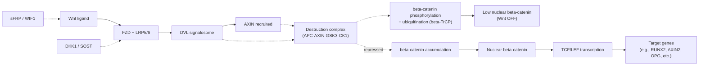
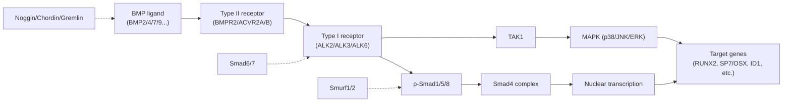
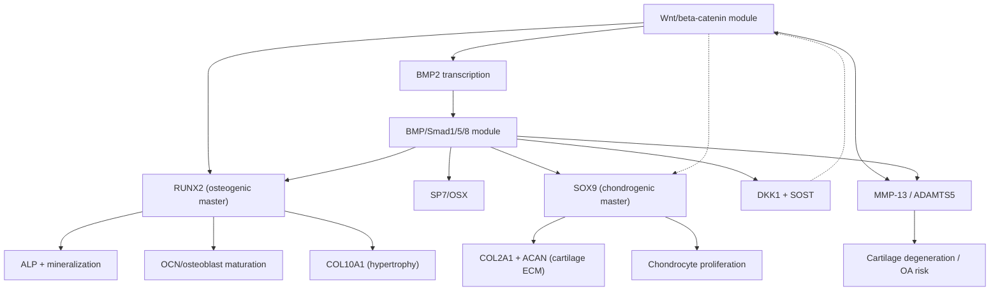

# Wnt/β‑catenin、BMP/Smad及其汇聚在成骨与成软骨中的作用机制与比较研究报告

## 摘要

Wnt/β‑catenin与BMP/Smad是骨与软骨发育、稳态维持与病理重塑中最核心、证据最坚实的两条保守信号通路之一。经典Wnt/β‑catenin以“破坏复合体（APC–AXIN–GSK3–CK1）控制β‑catenin稳定性”为枢纽，通过TCF/LEF驱动转录程序，决定间充质干细胞（MSC）谱系承诺并调控骨重塑；经典BMP/Smad以“BMP配体–I/II型丝氨酸/苏氨酸激酶受体–Smad1/5/8–Smad4核内转录复合体”为主干，广泛促进成骨/成软骨相关基因网络，但其输出高度依赖细胞类型、分化阶段与信号强度。两者并非独立运行：Wnt可直接上游激活BMP2转录，BMP又可通过诱导Wnt拮抗因子（如DKK1、SOST）对Wnt形成反馈抑制；此外，Wnt通过抑制GSK3延长BMP/Smad1信号持续时间，从“蛋白磷酸化—降解动力学”层面实现汇聚。上述互作使得Wnt与BMP在**成骨**中常表现为协同放大（尤其在MSC向成骨谱系承诺与早期分化阶段），在**成软骨/软骨稳态**中则呈现“需要平衡”的双刃剑特征：适度BMP与受控Wnt对软骨形成与基质合成具有支持作用，但过强Wnt或过强BMP均可能推向软骨细胞肥大、基质降解与骨关节炎（OA）表型。

---

## 通路定义与经典级联

### Wnt/β‑catenin模块

**定义与核心构件**：经典Wnt/β‑catenin通路由Wnt配体、Frizzled（FZD）受体与共受体LRP5/6触发，胞内以Dishevelled（DVL）与AXIN调度“β‑catenin破坏复合体”（APC–AXIN–GSK3–CK1）为关键；通路开启时β‑catenin稳定并入核，与TCF/LEF转录因子共同调控靶基因。该“β‑catenin稳定性开关”是经典Wnt与其非经典分支（PCP、Wnt/Ca²⁺等）最核心的区分点之一。（Clevers & Nusse, 2012；Nusse & Clevers, 2017）

**激活/抑制机制**：  
无Wnt刺激时，β‑catenin被破坏复合体磷酸化后，经β‑TrCP介导泛素化并降解；有Wnt刺激时，受体复合体形成并将AXIN等组分招募到膜附近，破坏复合体失活，β‑catenin积累入核。（Clevers & Nusse, 2012）

**反馈与拮抗因子**（骨/软骨领域高频出现）：  
DKK1与SOST/硬化蛋白（sclerostin）可结合LRP5/6阻断经典Wnt信号（常伴随Kremen等协同），sFRP/WIF1等可在胞外层面“截获”Wnt配体；而AXIN2等则常作为Wnt靶基因形成细胞内负反馈。（Baron & Kneissel, 2013；Delgado‑Calle & Bellido, 2016；Hu等, 2024）

**非经典分支概览**：  
非经典Wnt分支通常不依赖β‑catenin稳定，可通过Ror2/Ryk等受体触发PCP（JNK、Rho/ROCK等）或Wnt/Ca²⁺（PLC、PKC、CaMKII、NFAT等），在骨/软骨微环境中常与细胞极性、迁移、力学应答及炎症表型相关。（Clevers & Nusse, 2012；Hu等, 2024）

**图1｜经典Wnt/β‑catenin级联示意（简化）**：以“破坏复合体—β‑catenin稳定性—TCF/LEF转录”为主干，并标出常见拮抗因子（DKK1、SOST、sFRP/WIF1）。该框架是理解Wnt在MSC谱系选择、骨形成与OA中“剂量与阶段依赖性”的基础。（Clevers & Nusse, 2012；Hu等, 2024）

---

### BMP/Smad模块

**定义与经典级联**：BMP属于TGF‑β超家族。经典BMP信号由BMP配体与II型受体（如BMPR2/ACVR2A/B）及I型受体（如ALK2/ACVR1、ALK3/BMPR1A、ALK6/BMPR1B）形成复合体；II型受体激活并磷酸化I型受体GS区后，I型受体进一步磷酸化R‑Smads（Smad1/5/8；亦常写作Smad1/5/9），其与共Smad（Smad4）形成复合体入核调控转录。（Wang等, 2014；Miyazono等, 2010）

**反馈抑制与胞外拮抗**：  
I‑Smads（Smad6/7）是经典负反馈抑制子，可阻断R‑Smads被受体激活，或招募E3连接酶（如Smurf1/2）促进信号组分降解；胞外层面常见Noggin、Chordin、Gremlin等BMP拮抗分子可中和BMP配体，限制信号扩散与强度。（Wang等, 2014；Wu等, 2016；Murakami等, 2003）

**非Smad分支**：  
BMP也可通过TAK1等引发MAPK（p38/JNK/ERK）及PI3K‑AKT等非Smad通路，影响细胞迁移、应激与分化速度，并在软骨肥大与骨修复环境下经常与炎症/力学信号交叉。（Wang等, 2014；Thielen等, 2019）

**图2｜经典BMP/Smad级联示意（简化）**：展示“受体异源复合体—Smad1/5/8‑Smad4入核”的主干，同时标注Smad6/7与胞外拮抗物及MAPK支路。该结构解释了BMP在骨/软骨中既可促分化也可促肥大/异位骨化的“输出可塑性”。（Wang等, 2014；Wu等, 2016）

---

## 成骨机制

本节以“MSC谱系承诺→成骨细胞分化与矿化→骨细胞成熟→骨重塑耦联”为主线，分别讨论Wnt、BMP及二者汇聚的分阶段作用与剂量效应。

### MSC谱系承诺与早期成骨分化

**Wnt/β‑catenin决定MSC骨/软骨命运分岔**：发育遗传学证据显示，在间充质祖细胞中条件性删除β‑catenin会使骨形成程序受阻并出现向软骨谱系偏移；β‑catenin在决定“成骨 vs 成软骨”上具有必要性。（Day等, 2005；Hill等, 2005）

**Wnt可直接上调RUNX2转录**：RUNX2是成骨主调控因子之一。JBC研究表明RUNX2启动子含TCF结合位点，经典Wnt可通过β‑catenin/TCF通路直接增强RUNX2转录，推动MSC向成骨谱系进入。（Gaur等, 2005）

**BMP/Smad为成骨转录程序提供强驱动**：BMP激活Smad1/5/8‑Smad4后可促进RUNX2表达，并与RUNX2在核内协同启动多种成骨基因表达；骨研究领域权威综述强调Smad1是BMP促成骨功能的重要介质。（Wu等, 2016）

**Osterix（SP7/OSX）与SATB2的层级位置**：OSX通常被置于RUNX2之后，是成骨细胞分化与矿化必需转录因子；SATB2常与RUNX2/OSX共同构成推动骨基质基因表达与成熟的网络节点。（Dobreva等, 2006；Liu等, 2020；Hassan等, 2010）

### 成骨细胞成熟、矿化与骨重塑耦联

**阶段特异性与剂量依赖性（Wnt）**：较新的骨系综述指出，经典Wnt在成骨不同阶段表现不同：可增强早期成骨分化，但持续高水平β‑catenin信号可能抑制终末矿化/成熟过程，提示存在明显“窗口期与强度阈值”。（Zhu等, 2024）

**成熟成骨细胞中的Wnt与骨吸收抑制**：Developmental Cell经典遗传学工作显示，在分化较晚的成骨细胞中稳定β‑catenin可导致高骨量，而删除β‑catenin引起骨量降低；其机制主要通过β‑catenin/TCF促进成骨细胞表达OPG（osteoprotegerin），从而抑制破骨细胞分化与骨吸收，揭示Wnt在骨重塑耦联中的关键位置。（Glass等, 2005）

**BMP信号的“既促成骨亦塑造重塑”特征**：BMP不仅驱动成骨分化，也可影响骨重塑相关因子（例如通过与Wnt互作改变成骨细胞功能输出）；BMP信号又受到Smad6/7、Smurf等负反馈强烈约束，避免过度成骨或异位骨化。（Wu等, 2016；Salazar等, 2016）

---

## 成软骨机制

本节覆盖成软骨从“间充质凝聚→SOX9主导的软骨谱系建立→软骨细胞增殖与基质生成→肥大与软骨内成骨→关节软骨稳态/退变”的关键节点，并强调Wnt与BMP在不同阶段可能呈现相反效应。

### 间充质凝聚与SOX9轴的建立

**BMP对早期成软骨的必要性（体内遗传证据）**：在软骨前体中同时缺失Bmpr1a与Bmpr1b会导致早期成软骨严重缺陷，并可归因于前软骨凝聚中SOX9、SOX5、SOX6表达缺失；该结果支持BMP信号在早期成软骨中的必要地位。（Yoon等, 2005；Yoon等, 2006）

**Wnt–SOX9的拮抗构型决定“软骨 vs 非软骨”**：经典研究显示SOX9可与β‑catenin发生物理/功能互作，通过与TCF/LEF竞争β‑catenin并促进β‑catenin降解，从而解除外源Wnt对成软骨的抑制；这提供了“SOX9主动关闭Wnt抑制信号”的分子解释。（Akiyama等, 2004；Topol等, 2009）

### 软骨细胞增殖、基质合成与肥大

**BMP在增长板与肥大成熟中的多阶段促进**：实验与综述证据指出，BMP信号可促进软骨细胞谱系承诺、增殖与向肥大成熟推进；PNAS研究进一步提出BMP信号在前软骨细胞与增长板软骨细胞中分别促进分化与向肥大成熟的推进。（Kobayashi等, 2005；Kakoi等, 2014）

**Wnt在软骨中呈“平衡依赖”的双相效应**：关节软骨领域大量证据提示Wnt/β‑catenin并非简单“好/坏”：过强Wnt活化与软骨退变、OA风险相关；但过度抑制Wnt/β‑catenin也会破坏增长板软骨细胞增殖与肥大、延迟次级骨化中心形成，甚至导致关节软骨结构受损，提示存在组织与阶段依赖的最佳强度区间。（Usami等, 2016；Yao等, 2023）

**软骨退变与OA中的基质降解程序**：多篇OA权威综述总结，Wnt/β‑catenin异常与基质降解酶（如MMP‑13、ADAMTS‑5）上调、软骨细胞肥大样改变相关，是OA潜在治疗靶点，但需要维持“适度抑制而非完全关断”的策略。（Corr, 2008；Yao等, 2023）

**BMP在关节软骨：既“保护”也可能“诱导肥大”**：Osteoarthritis and Cartilage综述提出BMP可促进软骨基质合成与修复，但也可增强软骨终末分化（肥大），并与MMP‑13上调等退变表型相关；因此BMP在关节软骨可能既是保护因子也可能是病理驱动，需要情境化调控。（van der Kraan等, 2010）

---

## Wnt与BMP的汇聚与互作机制

Wnt+BMP“汇聚”并不等同于简单叠加，而是至少发生在三个层级：转录层面的上下游、胞内蛋白复合体层面的互作、以及通过反馈抑制子构建的系统级耦合。

### Wnt上游激活BMP2转录

骨领域研究显示，β‑catenin/TCF可刺激BMP2启动子活性与BMP2 mRNA表达；阻断Wnt（如DKK1、sFRP4）或抑制β‑catenin/TCF活性会降低BMP2转录，提示Wnt可作为BMP2表达的上游调控器，从而把两条通路串联成“Wnt→BMP2→Smad1/5/8→成骨基因”级联。（Zhang等, 2013）

### BMP通过诱导Wnt拮抗因子反向调节Wnt输出

在成骨细胞中，BMPR1A介导的BMP信号可上调Wnt拮抗因子Dkk1与Sost；相应地，降低Bmpr1a会使Dkk1/Sost表达下降并增强Wnt/β‑catenin活性。该“BMP→（DKK1/SOST）⊣Wnt”回路为“为何BMP有时呈现抑制骨量/抑制Wnt”的表型提供机制解释，也提示骨量调控存在显著反馈稳态。（Kamiya等, 2010）

### Smad1作为Wnt‑BMP信号积分节点

Cell经典研究提出BMP/Smad1信号持续时间受Smad1连接区位点的MAPK与GSK3顺序磷酸化控制，GSK3磷酸化促进活化Smad1被泛素化与降解；由于Wnt可抑制GSK3，因而能延长BMP/Smad1活化信号持续时间，实现“Wnt通过GSK3抑制增强BMP信号”的时间维度汇聚。（Fuentealba等, 2007；Eivers等, 2009）

### 协同与拮抗的功能结果取决于阶段与靶基因位置

在成骨环境中，β‑catenin与BMP‑2可在转录层面产生协同促进成骨分化的现象；但在软骨/关节环境中，BMP和Wnt共同增强肥大与基质降解程序的风险也被多综述总结。换言之，“汇聚”既可用于骨再生的协同放大，也可能在OA中放大退变程序，关键在于调控强度、时序与细胞靶向。（Mbalaviele等, 2005；Yao等, 2023）

**图3｜Wnt与BMP汇聚示意（与成骨/成软骨表型关联）**：  
- 共享核心靶：RUNX2（成骨）与SOX9（成软骨）构成“谱系主开关”；Wnt通常抑制SOX9主导的早期成软骨，而BMP促进SOX9程序（在早期凝聚/分化阶段尤明显）。  
- 关键互作：Wnt上游促进BMP2转录；BMP可通过诱导DKK1/SOST反馈抑制Wnt；二者共同影响肥大/降解轴（COL10A1、MMP‑13/ADAMTS5）。  
（Zhang等, 2013；Kamiya等, 2010；Akiyama等, 2004；Yao等, 2023）

---

## 三模块多维度比较与转化启示

### 多维度比较表

| 维度 | Wnt/β‑catenin（单独） | BMP/Smad（单独） | Wnt+BMP汇聚（互作模块） |
|---|---|---|---|
| 典型配体 | Wnt家族（如WNT3A、WNT10B等） | BMP2/4/7/9等（TGF‑β超家族成员） | 同时存在或时序表达（Wnt可诱导BMP2） |
| 受体/共受体 | FZD + LRP5/6（经典） | I型受体（ALK2/3/6）+ II型受体（BMPR2/ACVR2A/B） | BMP可诱导DKK1/SOST调节LRP5/6可用性 |
| 胞内关键介质 | DVL、AXIN、GSK3、APC、β‑catenin | Smad1/5/8、Smad4；并行TAK1‑MAPK、PI3K‑AKT | Smad1受GSK3调控，Wnt抑制GSK3可延长BMP/Smad信号 |
| 核内效应器 | β‑catenin/TCF‑LEF复合体 | pSmad1/5/8‑Smad4复合体 | 可形成“互作/并行占位”的转录整合（依细胞背景而变） |
| 典型靶基因/节点 | RUNX2（直接靶之一）、AXIN2、OPG等 | RUNX2、SP7/OSX、ID家族、软骨相关程序 | 共同指向RUNX2、肥大/降解轴（COL10A1、MMP‑13等） |
| MSC命运影响 | β‑catenin是“成骨 vs 成软骨”关键决定因子；缺失倾向软骨化 | 在早期与中期促进骨/软骨相关分化程序，但输出依赖受体组合与强度 | 可协同提升MSC对成骨因子的响应，也可在特定条件下加速软骨肥大→软骨内成骨进程 |
| 软骨细胞命运影响 | 需要“平衡”：过强促肥大/退变；过度抑制亦损害增长板/关节稳态 | 促进基质合成与修复，但也可促终末分化/肥大与MMP‑13上调风险 | 双通路共同激活时更需控制时序与剂量，否则易放大肥大与降解程序 |
| 时间动力学 | 成骨不同阶段作用不同：早期促进，晚期可能抑制矿化（窗口期） | 多阶段参与，但负反馈（Smad6/7、拮抗物）限制持续强刺激 | “串联+反馈”使系统呈现稳态调节：Wnt→BMP2与BMP→DKK1/SOST构成双向耦合 |
| 剂量依赖性 | 过强或过弱都可能产生不良结局（骨：成熟抑制；软骨：OA或发育受损） | 过强BMP可能导致肥大/异位骨化；过弱导致骨/软骨发育不足 | 汇聚可放大剂量效应：协同再生 vs 放大病理，需要精准剂量与靶向 |
| 典型反馈抑制子 | DKK1、SOST、sFRP/WIF1、AXIN2等 | Smad6/7、Smurf1/2、Noggin/Chordin/Gremlin等 | BMP可诱导DKK1/SOST；Smad1可被GSK3调控，形成跨通路反馈与积分 |
| 疾病关联 | 骨质疏松（Wnt受抑）；OA（Wnt失衡） | 骨修复/骨量异常；OA中BMP既保护也可驱动肥大与骨赘 | OA、软骨内成骨、骨‑软骨耦联异常往往涉及两通路共同失衡 |
| 证据类型（代表） | 遗传模型：β‑catenin、Lrp5/6条件敲除/突变；体外MSC分化；人群遗传与GWAS综述 | 遗传模型：Bmpr1a/b、Smad1/5、Smad6/7；增长板/关节模型；体外BMP诱导分化 | 互作证据：Wnt诱导BMP2转录、BMP诱导DKK1/SOST、Smad1‑GSK3积分；组织工程/药物干预研究 |
| 转化启示 | 抗骨质疏松：解除Wnt抑制（如靶向SOST）；OA：Wnt抑制需“适度” | 骨修复：BMP（如BMP2）具强成骨诱导力但需控剂量与定位；OA：局部抑制BMP被探索 | 组合策略可能优于单通路：骨再生可利用协同；关节软骨治疗需避免“协同放大肥大/降解” |

**表1｜三模块在成骨/成软骨中的多维度比较**：该表强调“同一通路在不同阶段/组织中可能方向相反”，并把互作机制（Wnt→BMP2、BMP→DKK1/SOST、Smad1‑GSK3积分）显式纳入比较维度，便于从系统角度理解协同与拮抗何时发生。

---

## 结论

总体而言，Wnt/β‑catenin与BMP/Smad共同构成骨‑软骨发生与稳态的“主控制面板”。在**成骨**中，Wnt通过决定MSC谱系分岔并直接驱动RUNX2转录启动成骨程序，同时在成熟成骨细胞阶段通过上调OPG抑制破骨分化而调控骨重塑；BMP/Smad则通过Smad1/5/8‑Smad4与RUNX2/OSX/SATB2等转录网络协同推动成骨分化与矿化，但其输出受Smad6/7与胞外拮抗物严格限幅。两通路汇聚使得“骨再生可协同放大”成为可能：Wnt可上游诱导BMP2并通过抑制GSK3延长Smad1信号时程；与此同时，BMP又可诱导DKK1/SOST反向抑制Wnt，形成稳态反馈。在**成软骨与关节软骨稳态**中，BMP对SOX9轴与早期成软骨凝聚必不可少，但过强BMP可推动肥大与退变风险；Wnt/β‑catenin则表现出更显著的“平衡依赖性”，过强或过弱都可能破坏增长板或关节软骨结构并与OA表型相关。临床与转化研究因此越来越强调“时空与剂量精确控制”：骨质疏松倾向解除Wnt抑制、骨缺损修复可利用BMP的强诱导性；而OA更需要避免粗暴关断Wnt或放大BMP肥大信号，通过组织特异、阶段特异的方式实现“促修复而不促退变”的信号重编程。

---

## 参考文献

1) Clevers & Nusse（2012）Wnt/β‑catenin signaling and disease（Cell）  
2) Nusse & Clevers（2017）Wnt/β‑catenin Signaling, Disease, and Emerging Therapeutic Modalities（Cell）  
3) Baron & Kneissel（2013）WNT signaling in bone homeostasis and disease（Nat Med）  
4) Hu等（2024）Wnt/β‑catenin signaling in bone formation, homeostasis, and disease（Bone Research）  
5) Salazar、Gamer & Rosen（2016）BMP signalling in skeletal development, disease and repair（Nat Rev Endocrinol）  
6) Wang等（2014）BMP signaling in development and disease（Cytokine & Growth Factor Reviews）  
7) Wu等（2016）TGF‑β and BMP signaling in osteoblast and skeletal development（Bone Research）  
8) Day等（2005）Wnt/β‑catenin in mesenchymal progenitors controls osteoblast vs chondrocyte fate（Dev Cell）  
9) Hill等（2005）Canonical Wnt/β‑catenin prevents osteoblasts from adopting chondrocyte fate（Dev Cell）  
10) Gaur等（2005）Canonical Wnt directly stimulates Runx2 gene expression（J Biol Chem）  
11) Glass等（2005）Wnt in differentiated osteoblasts controls osteoclast differentiation via OPG（Dev Cell）  
12) Yoon等（2005）Bmpr1a/Bmpr1b redundancy; BMP required for early chondrogenesis（Genes Dev/或相关原文）  
13) Akiyama等（2004）Sox9–β‑catenin互作控制软骨分化（Genes Dev）  
14) Fuentealba等（2007）Wnt/GSK3调控BMP/Smad1信号时程（Cell）  
15) Zhang等（2013）Wnt/β‑catenin激活BMP2表达并影响成骨（Bone）